# Playtest report

**This is an automated playtest, not a human one.** Everything below was
measured by scripts driving the real game in a headless browser, or
computed from the generator. It says what the game *does*. Whether it is
*fun* is still a question only a person can answer, and the last section
says what to watch for when one does.

The first version of this report found that the run had no decision in it:
eight gems on a floor, a toll of three, and nothing that moved. The game
has since been reworked around that finding, and section 1 describes what
it is now.

## 1. The run, by the numbers

Measured over 400 generated floors at each depth, with the shipped room
templates registered, so these are the floors the game actually builds.

| Measure (min / mean / max) | Floor 1 | Floor 2 | Floor 3 |
| --- | --- | --- | --- |
| Rooms on a floor | 8 / 9.0 / 10 | 10 / 11.6 / 13 | 12 / 13.8 / 16 |
| Doorways from start to exit | 3 / 4.3 / 8 | 3 / 4.9 / 8 | 4 / 5.4 / 9 |
| Gems available | 9 / 10.0 / 11 | 11 / 12.6 / 14 | 13 / 14.8 / 17 |
| Chests | 3 / 4.7 / 8 | 5 / 8.6 / 13 | 7 / 11.4 / 19 |
| Watchers | none | 0 / 2.1 / 6 | 0 / 4.5 / 9 |
| Locked vaults | 400 of 400 | 400 of 400 | 400 of 400 |
| Walking the shortest path, no stops | 14 / 19 / 31 s | 14 / 21 / 32 s | 17 / 22 / 33 s |
| Alarm on arrival | 0 | 1 | 2 |
| Rooms before the Warden wakes | 3 | 2 | 1 |
| Light: ambient / overhead / fog | 0.70 / 18 / 46 | 0.50 / 14 / 41 | 0.34 / 11 / 36 |

A run is three floors, and each is larger and worse than the one above it.
The exit charges 3 gems, then 5, then 7: fifteen in tolls against about
thirty-seven on the ground, so a run that took everything and paid every
toll would climb out with twenty-two. That number is the score, and nothing
else is.

**The bargain.** Every gem taken raises the floor's alarm, and the alarm is
the only thing the Warden reads. Six gems fully rouse it, and the shallowest
floor holds ten, so the back half of any floor is worked against a Warden
that hunts rather than wanders, steps between rooms every four seconds
instead of nine, and crosses a room at 4.4 units a second. Deeper floors
start part-roused, so the third needs only one gem to set it hunting. The
player walks at 5 and runs at 8, so it can never simply catch someone who
keeps moving. It wins by being in the doorway you wanted.

That is the whole decision the game asks, once a room: the toll is paid,
the exit is open, and there are four more gems on this floor. Do you go
back for them?

**Three things push back in different ways.** The Warden roams and makes
you leave a floor. The Sentry is nailed down and makes you time your
crossing of a room; it never takes a life, only rouses the floor. The arena
is a fixed fourteen seconds of keeping ahead of turning spikes, once, when
you choose to start it.

**Identification pays now.** About twenty-two chests over a run against
eight kinds of item means duplicates are common, so learning that the inky
bottle is healing is knowledge you will get to use. Earlier this was not
true and the report said so.

**What each thing costs.**

| | Cost | What it buys |
| --- | --- | --- |
| Exit, floor 1 / 2 / 3 | 3 / 5 / 7 gems | The way down, and the way out |
| A life | 1 gem | One more mistake |
| A name for an item | 1 gem | Knowing without spending it |
| A chest | free | One potion or scroll, contents unknown |
| A vault | one iron key, found on the floor | A room with three chests and a gem |
| Warden's Lantern | 2 gems | Always knowing which room it is in |
| Robber's Chart | 2 gems | Rooms that still hold a gem, on the map |
| Soft Boots | 3 gems | A quarter more speed |
| Bone Charm | 3 gems | The first hit on each floor |
| Ash Censer | 4 gems | Gems rouse the floor half as much |
| Toll Ledger | 4 gems | A gem off every exit |

Relic prices rise by one per floor. The shop offers two, fixed per floor
and per seed, so a shop is the same shop every time you walk back into it.

## 2. What three independent code reviews found

Two reviewers read the whole tree after the rebuild. Their confirmed
findings, all fixed on this branch:

- **Trap rooms had no spikes and the memory trial had no crystals.** Both
  used a ring of points filtered against the door lanes, and at every size
  the generator makes, every point of both rings fell in a lane. The
  screenshot tour had shown an empty trap room and nobody noticed. Rooms
  now use three anchor families (near, far, corner) that are distinct by
  construction; spikes sit between the gem and the lanes; the trial has
  four crystals on the far anchors.
- **The shop sold nothing worth buying.** It now sells relics as well as
  lives, and the pedestals take two of the far anchors.
- **The gem could land inside a prop or on the challenge altar.** The gem
  now takes the anchor farthest from what the room's content has claimed,
  and the dressing keeps clear of the gem, the content and the spikes.
- **Doorways were open holes.** Walking through one led onto the invisible
  ground plane with no way back. Each gap now has an invisible collider;
  doors are taken with E.
- **A failed puzzle was forgotten on leaving the room.** The run now owns
  `failed` alongside `cleared`, so a sprung trap or a burned book stays so.
- **A second miss in the memory trial's flare could award the gem** from a
  burned book. Input closes on the first miss.
- **The pause poll ate gamepad presses**, and Esc inside the number puzzle
  opened the pause menu under it. Pad pause is read in the frame loop; Esc
  belongs to the puzzle while one is open.
- **The editor accepted any JSON as a template**, including unknown prop
  kinds that crashed it on every reload, and offered room sizes the game
  does not define. Templates are validated on import and on load.
- **A painted surface never reached materials already on screen**, and the
  painter could open on the default and overwrite the painting on save.

`yarn test:layout` now checks the geometry over every size and 500 seeds,
so the first two cannot come back silently.

A third review, after five rounds of additions, found ten more. The worst
were all one bug class - a fact computed twice from different premises,
which is exactly what ARCHITECTURE.md is written against:

- **The minimap turned the wrong way.** SVG rotation by the camera's yaw
  puts the facing direction at the top; the code used minus that, so the
  map was mirrored east to west. It was right when facing north or south,
  which is why looking at it did not catch it.
- **The arena had four safe corners.** Its arms swept circles out to the
  drawn floor, but its walls are a square whatever shape the floor is, so
  a player could stand in a corner the rings never reached - in the one
  room whose whole promise is that there is nowhere safe to stand.
- **The run's seed was destroyed on the way down.** Each floor generates
  from a seed derived from the last, and the summary was showing that
  rather than the run's, so every "same dungeon again" replayed a dungeon
  nobody had played.
- **The Sentry's beam angle was `Math.random()`**, so a replayed seed put
  the watchers back in the right places pointing the wrong ways.
- **The arena's cleanup timer was cancelled by the unmount that needed
  it**, so dying to the arms and starting a new run left its hint pinned to
  the screen.
- **Timed potions ran on wall time**, so twenty seconds in the pause menu
  spent a Potion of Swiftness. The run now owns a clock that stops.
- The Sentry wrote the alarm directly rather than through the store, the
  gem could be collected mid-transition, one array was holding both "the
  key has been taken" and "this door is open", and the shop would sell a
  life that left a player under the toll on a floor with no gems left.

All ten are fixed, and the tests grew to match: the arena's arms must reach
the corners of the box, a replayed seed must reproduce every watcher's beam
angle, the run's seed must survive a descent, and a pause must not spend a
potion.

Two more turned up on the next pass, both of them things nobody had looked
at because the tests were green:

- **Every floor in the game was a smeared barcode.** Surfaces were filtered
  at a fixed anisotropy of 4, which is not enough for a plane seen almost
  edge-on - which is how a first-person player sees the floor for the entire
  game. It collapsed into wide bands running to the horizon. The filtering
  is now taken from the renderer's own maximum, and the floor reads as
  flagstones. It was only found by taking a screenshot at eye level; every
  earlier screenshot had been from above.
- **The layout check was not checking the game's dungeons.** It never
  registered the shipped room templates, and the generator draws a random
  number when it asks for templates by kind - so with an empty registry it
  produced a different dungeon for the same seed. Every dungeon those 500
  seeds validated was one the game would never build. It registers them now
  and fails if none of the 500 contains an authored room.

## 3. What the automated walkthrough does

`scripts/smoke-test.mjs` plays a run the way a player does, with the
keyboard: it walks to doorways and presses E, prefers doors to rooms it has
not seen, picks up gems by walking into them, tries the exit unpaid and
paid, descends, wins from the last floor, restarts, and dies. It then
drives the systems that a random walk would not reliably reach - the toll
curve, relics, the satchel, the arena's doors barring and letting go, the
vault and its key, the records, and where the Sentries are. Sixty-one
checks pass on the current build.

One thing in it is a fixture rather than a test: the walker stands still to
sample the floor, which on spikes is a way to die, so it is kept on its
feet through the exploration phase. Dying has its own checks further down.

`yarn test:layout` needs no browser and guards the geometry over every room
size and 500 seeds: anchors clear of the door lanes and on the floor a
shaped room actually draws, spikes in every trap room, the gem reachable
without touching one, the generator connected, and a vault that never
blocks the way to the exit.

## 4. What every room looks like

Captured from the doorway on a software renderer; a real GPU is brighter
and smoother.

| Kind | What the player finds |
| --- | --- |
| 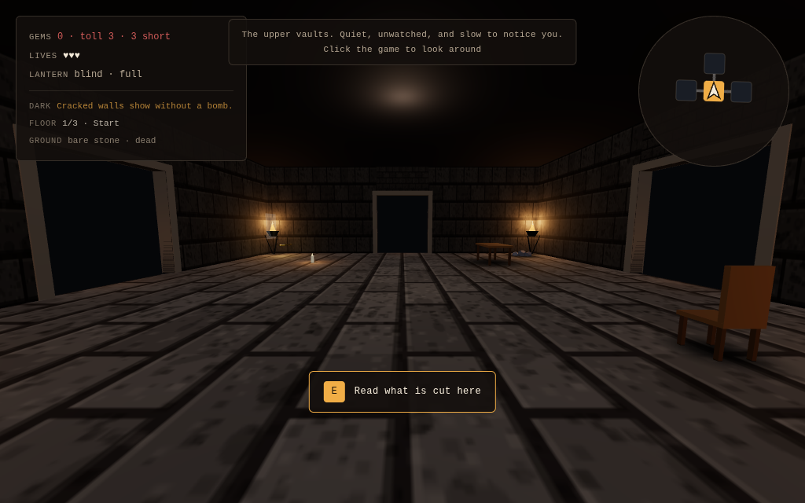 | **Start.** A table, a chest, braziers, two glowing doorways. The hint says how to look. |
| 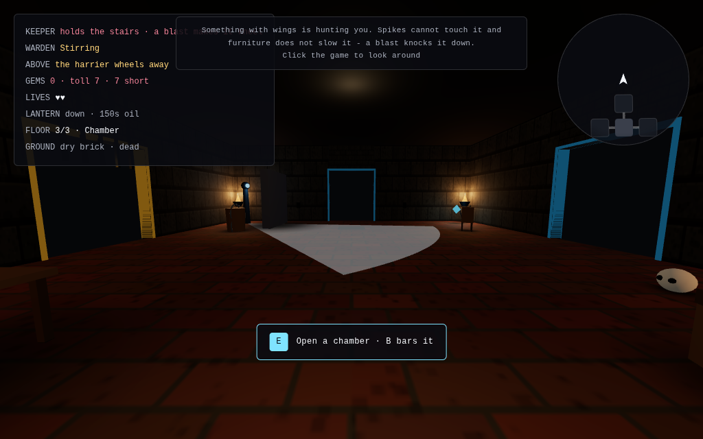 | **Chamber.** A gem, a chest, and from the second floor down often a watcher turning a beam around the room. |
| 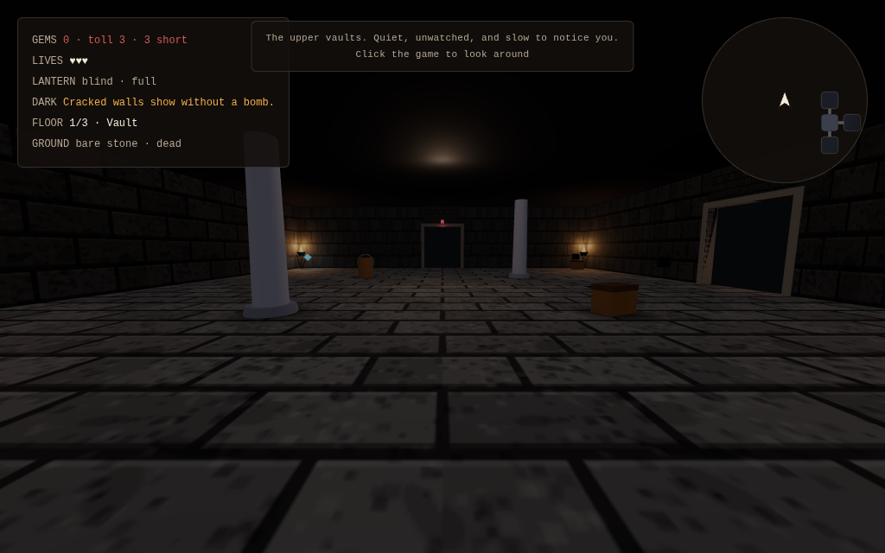 | **Vault.** Chests and a crystal; an authored layout from the Room Builder ships here. |
| 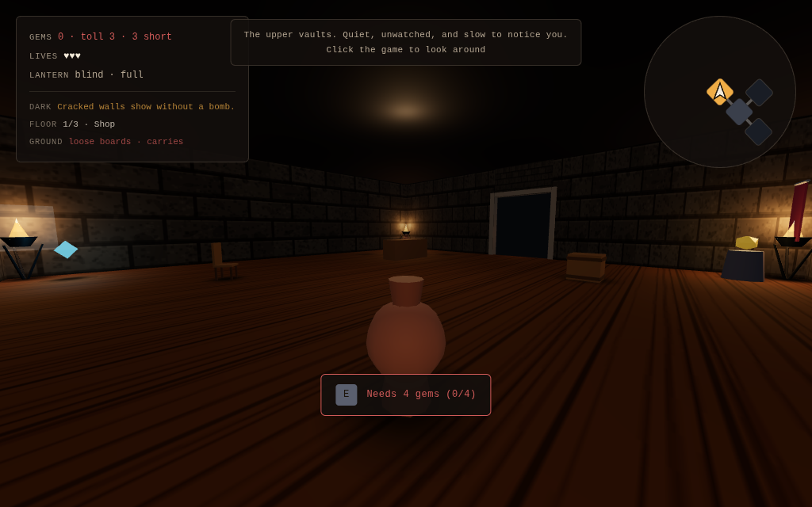 | **Shop.** A counter that sells a life for a gem. |
| 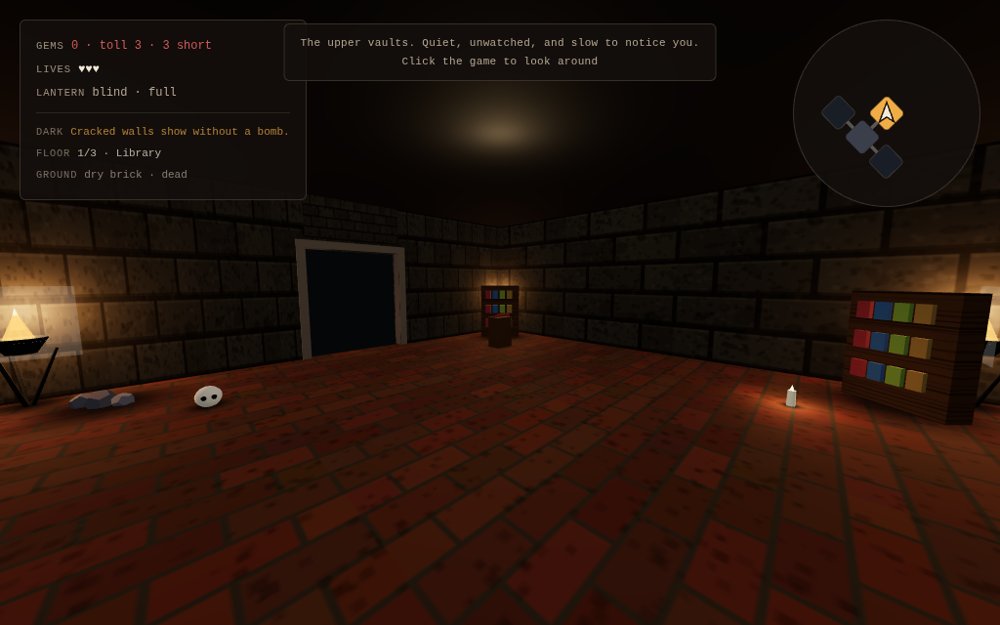 | **Library.** A lectern opens the number puzzle; solving it pays a gem. The red frame is a locked exit. |
| 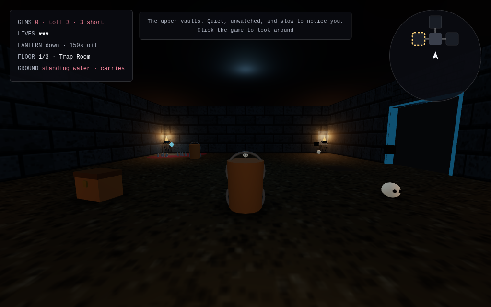 | **Trap room.** A ring of spikes between the doors and the gem. |
| 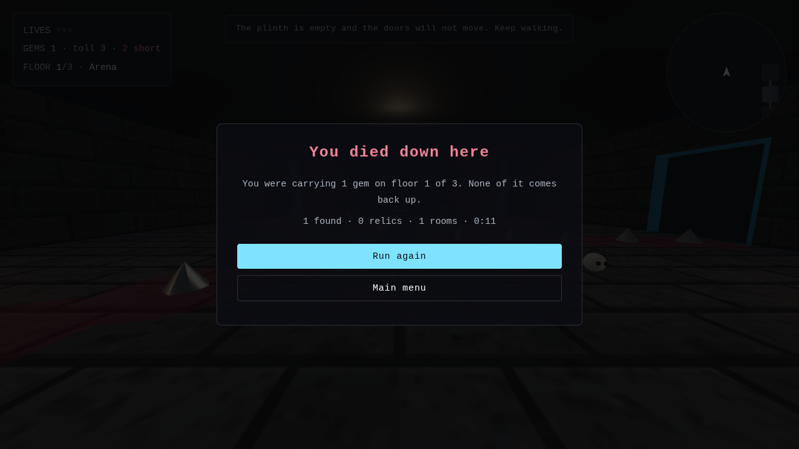 | **Arena.** A plinth in the middle. Lifting its gem bars the doors and sets three arms of spikes turning. |
| 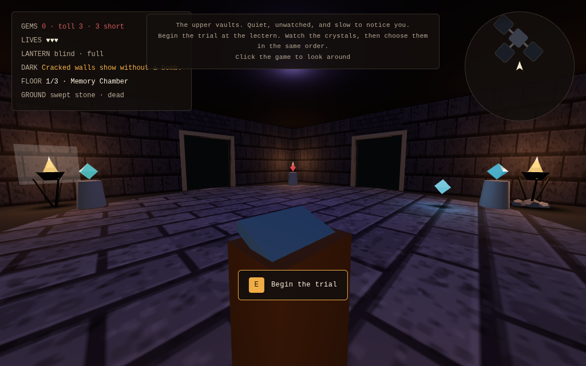 | **Memory chamber.** Five crystals on pedestals; watch the order, repeat it with E. |
| 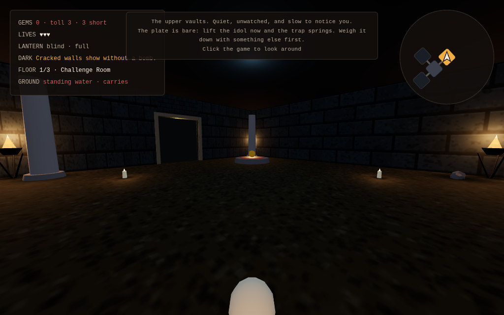 | **Challenge room.** An idol on a pressure plate; weigh the plate with a candle before lifting it, or lose a life. |
| 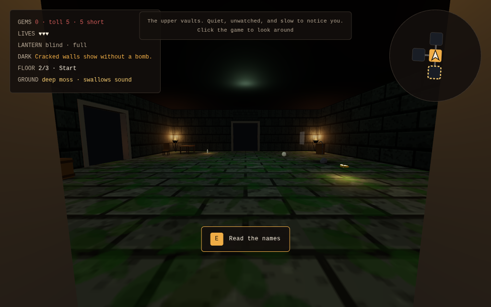 | **Exit.** Crystals and pillars; reaching it descends or wins. |
| 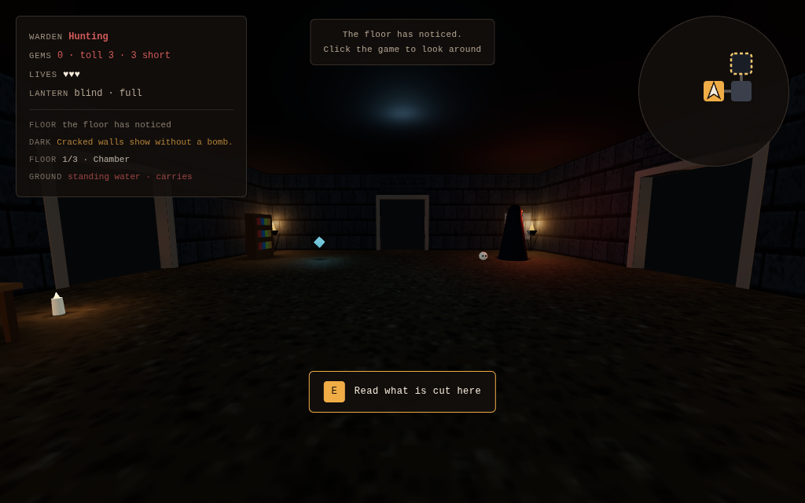 | **The Warden**, in a room with you. It drifts, it does not walk; it passes through everything; its eyes go from cold to orange to red as the floor wakes. |

## 5. Steam Deck

Checked at 1280x800: HUD, hint, prompt and menu text scale with the
viewport (about 15 px on the Deck's panel, capped on desktop). The pad
mapping is the standard one and was verified with a synthetic gamepad;
nobody has held a Deck with this on it.

## 6. What a human playtest should watch for

- **Is the Warden frightening or annoying?** It cannot be fought, blocked
  or outpaced, only avoided. That is either tense or it is a tax. The two
  dials are `WARDEN_SPEED_ROUSED` and `WARDEN_STEP_ROUSED_S`.
- **Does anyone go back for the last gems?** If players always leave the
  moment the toll is paid, the alarm is too punishing or the score is not
  visible enough. If they always strip the floor, it is not punishing at all.
- **Do the relics get bought?** A relic costs gems that would otherwise be
  score, so a player who never buys one is telling you the relics are weak
  or the score is too precious. Watch whether anyone buys the Ash Censer,
  which is the one that explicitly pays for greed.
- **Is the arena's fourteen seconds the right length?** It is the only
  timed thing in the game. Too short and it is a formality; too long and it
  is a chore, and the Warden may arrive in the middle of it either way.
  `ARENA_DURATION_S` and `ARENA_SPIN` are the dials.
- **Is the Sentry read or endured?** Its beam is drawn on the floor so it
  can be judged. If players walk through it rather than round it, either
  the wedge is not visible enough or the alarm it costs is too cheap to
  care about.
- **Does anyone chase a personal best?** The records screen is the only
  reason to play a fourth run once the novelty of the first three is gone.
  If people ignore it, the demo needs a reason to replay that is inside the
  dungeon rather than beside it.
- **Does the vault get opened?** The key is somewhere on the floor and the
  vault is never on the way out, so finding it is entirely optional. If
  nobody bothers, three chests is not enough of a prize; if everybody
  detours for it, the alarm cost of the extra walking is too cheap.
- **Is the head bob too much, or not enough?** It is small on purpose and
  can be switched off in the pause menu, because it makes some people ill.
  Watch whether anyone reaches for that.
- **Does anyone work out the inner line?** Keeping ahead of the arms near
  the middle is a walk and near the wall is a dash. That is the whole skill
  of the room, and it is never explained.
- **Is the first meeting readable?** The Warden wakes after three rooms on
  the first floor, and the game says one line about it, once. If players do
  not understand that running works, that line is not doing its job.
- **Three floors of the same ten room kinds.** Watch for the point where a
  player recognises a room and stops looking at it. The deeper floors are
  bigger, which buys variety and spends patience; the third is around half
  again the size of the first.
- **Is the bottom floor too much?** It arrives at alarm 2 with one room of
  grace and two thirds of its plain rooms watched. That is meant to read as
  the bottom of something. If players stop taking gems there rather than
  hurrying, it has tipped from tense to hopeless.
- **Does anyone drink the unknown potion?** Four slots, eight items, two of
  which wake the floor. If players hoard and never use them, the good ones
  are not good enough or the bad ones are too frightening. If they drink
  everything the moment they find it, there is no decision there either.
- **Is identification worth anything over one run?** Learning that the inky
  bottle is healing only pays if you find a second one. Watch whether
  anyone gets to use that knowledge, and if not, chests need to be commoner
  or the run longer.

## 7. Tuning knobs

All in `src/game/world.ts`:

| Constant | Value | Meaning |
| --- | --- | --- |
| `FLOORS` | 3 | Floors in a run |
| `TOLL_BASE` / `TOLL_STEP` | 3 / 2 | The exit's price, and how much it rises per floor |
| `GEMS_PER_LIFE` | 1 | Shop price |
| `STARTING_LIVES` | 3 | Lives at the start; carried between floors |
| `DAMAGE_COOLDOWN_S` | 1.5 | Invulnerability after a hit |
| `WALK_SPEED` / `DASH_SPEED` | 5 / 8 | Units per second |
| `ALARM_PER_GEM` | 1 | How much a gem rouses the floor |
| `ALARM_HUNTS_AT` / `ALARM_MAX` | 3 / 6 | When it starts hunting, and when it stops getting worse |
| `WARDEN_SPEED_CALM` / `_ROUSED` | 2.2 / 4.4 | How fast it crosses a room |
| `WARDEN_STEP_CALM_S` / `_ROUSED_S` | 9 / 4 | Seconds between rooms |
| `SENTRY_SPIN` | 0.55 | Radians a second the beam turns |
| `SENTRY_PATIENCE` / `SENTRY_ALARM` | 0.9 s / 1 | How long in the light before it calls, and what that costs |
| `ARENA_DURATION_S` / `ARENA_SPIN` | 14 / 0.75 | How long the arms turn, and how fast |

Everything that changes with depth is one table, `floorRules(floor)` in the
same file - the generator, the Warden's grace, the alarm a floor starts at,
how many rooms are watched, how the floor is lit, and the line the player is
shown on arriving:

| Floor | Rooms | Warden grace | Alarm on arrival | Rooms watched |
| --- | --- | --- | --- | --- |
| 1 | 8-10 | 3 rooms | 0 | none |
| 2 | 10-13 | 2 rooms | 1 | 45% |
| 3 | 12-16 | 1 room | 2 | 65% |

Floor three therefore arrives one gem short of `ALARM_HUNTS_AT`: the first
thing taken down there sets the Warden hunting, and it is dark enough that
the braziers are the only reason a corner has anything in it. A floor's
arrival alarm is a baseline as well as a starting value - a Scroll of
Banishment calms the floor but never past it. `yarn test:layout` checks that
no row is gentler or brighter than the one above it, and `yarn test:smoke`
walks a seed down all three floors twice and compares them room for room.
