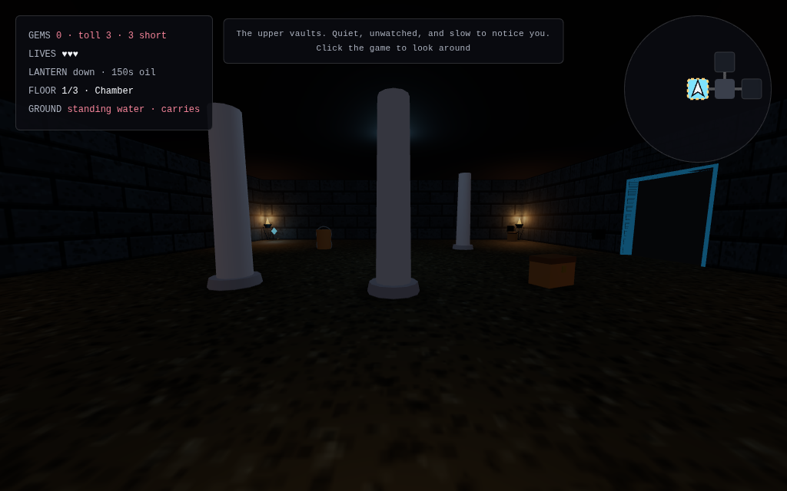
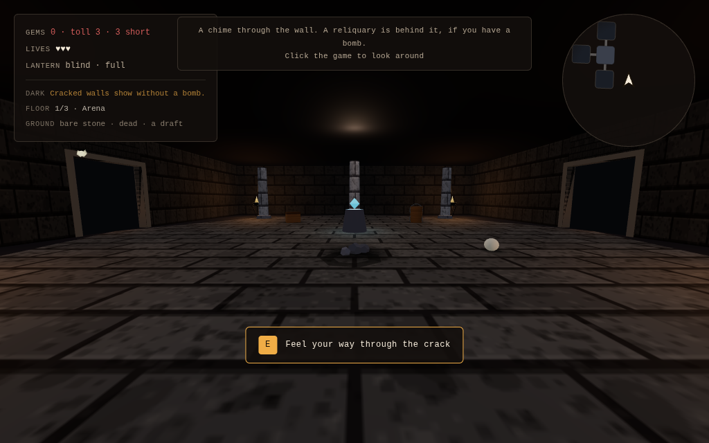
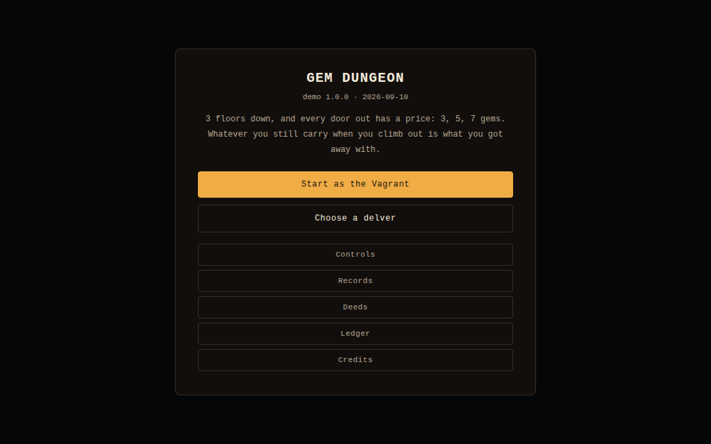
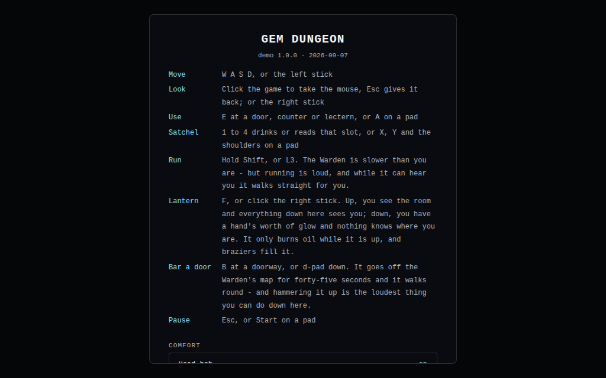
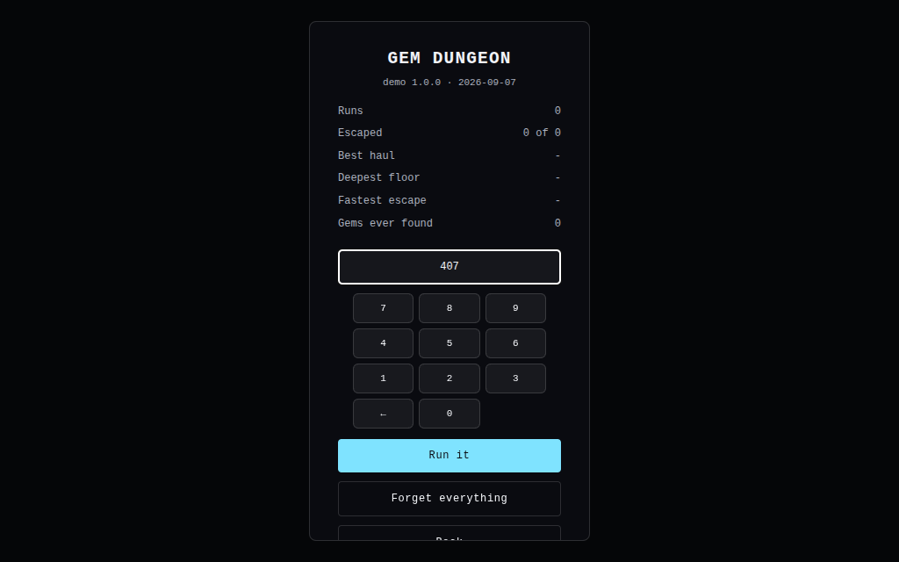
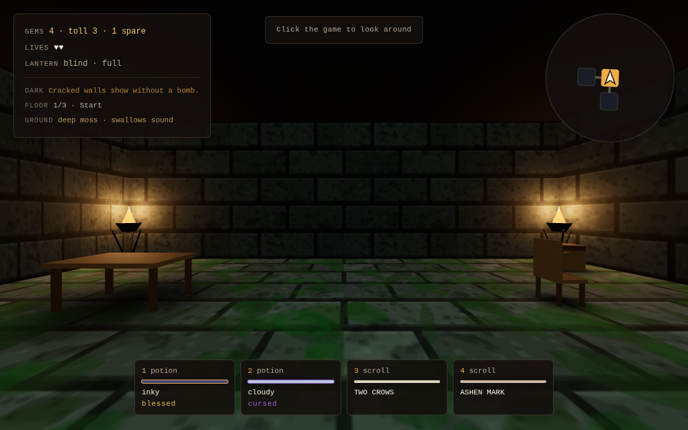
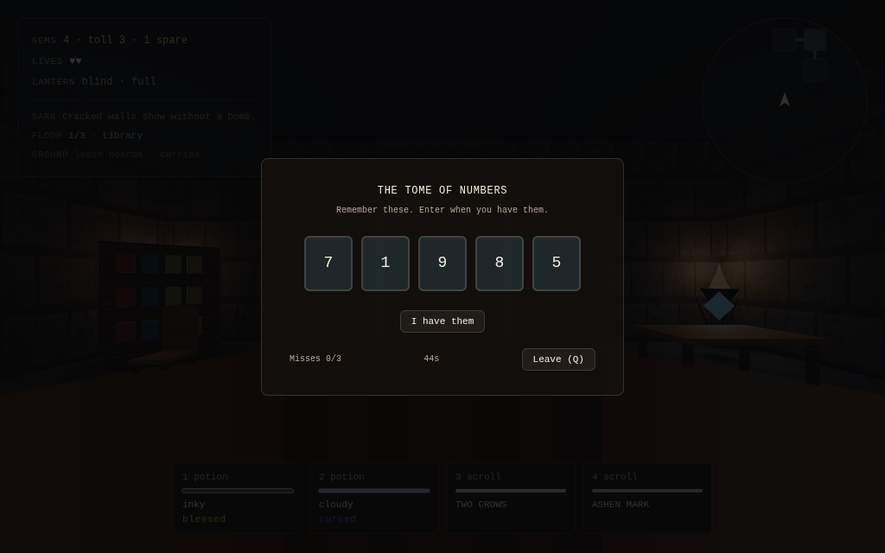
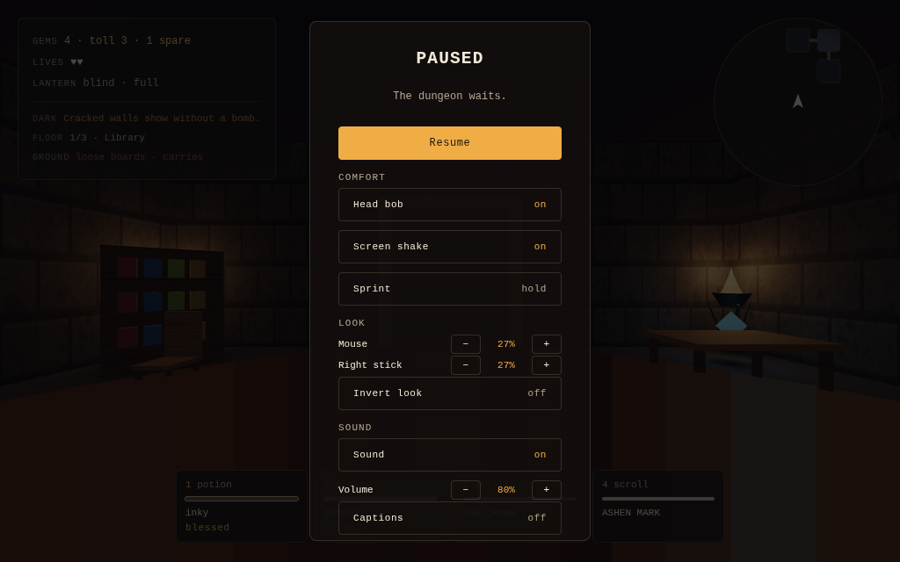
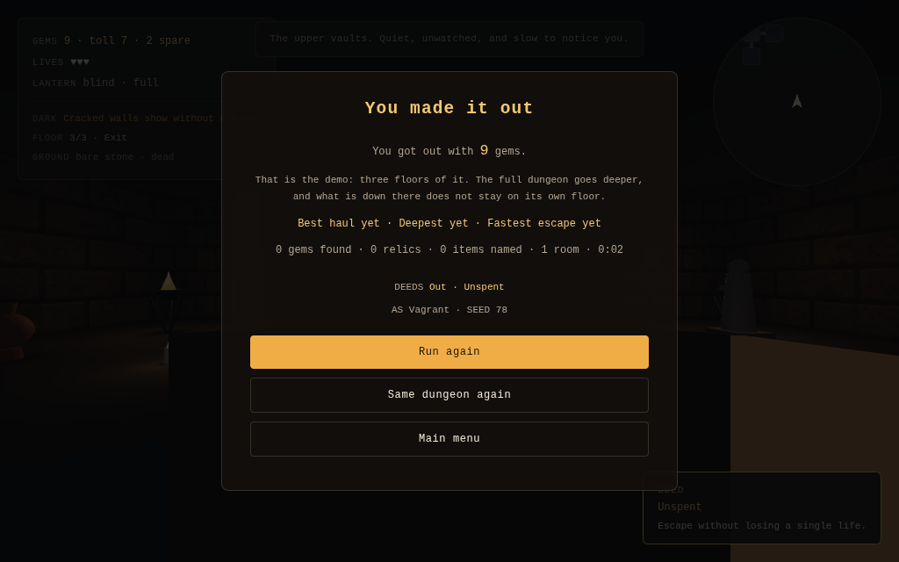
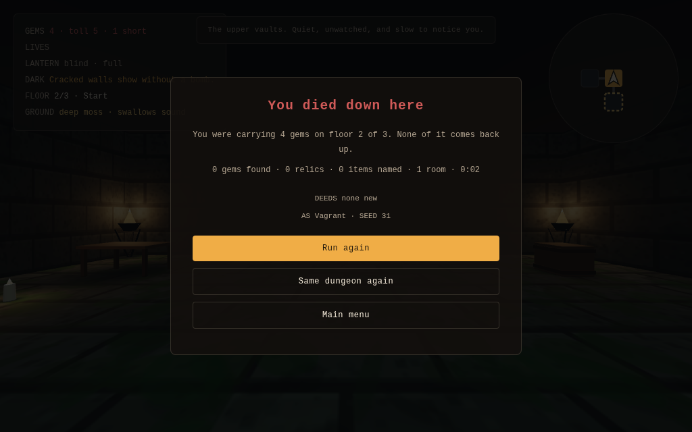

# Playtest report

**This is an automated playtest, not a human one.** Everything below was
measured by scripts driving the real game in a headless browser, or
computed from the generator. It says what the game *does*. Whether it is
*fun* is still a question only a person can answer, and the last section
says what to watch for when one does.

The first version of this report found that the run had no decision in it:
eight gems on a floor, a toll of three, and nothing that moved. The game
has since been reworked around that finding, and section 1 describes what
it is now.

## 1. The run, by the numbers

Measured over 400 generated floors at each depth, with the shipped room
templates registered, so these are the floors the game actually builds.

| Measure (min / mean / max) | Floor 1 | Floor 2 | Floor 3 |
| --- | --- | --- | --- |
| Rooms on a floor | 8 / 9.0 / 10 | 10 / 11.6 / 13 | 12 / 13.8 / 16 |
| Doorways from start to exit | 3 / 4.3 / 8 | 3 / 4.9 / 8 | 4 / 5.4 / 9 |
| Gems available | 9 / 10.0 / 11 | 11 / 12.6 / 14 | 13 / 14.8 / 17 |
| Chests | 3 / 4.7 / 8 | 5 / 8.6 / 13 | 7 / 11.4 / 19 |
| Watchers | none | 0 / 2.1 / 6 | 0 / 4.5 / 9 |
| Locked vaults | 400 of 400 | 400 of 400 | 400 of 400 |
| Walking the shortest path, no stops | 14 / 19 / 31 s | 14 / 21 / 32 s | 17 / 22 / 33 s |
| Alarm on arrival | 0 | 1 | 2 |
| Rooms before the Warden wakes | 3 | 2 | 1 |
| Light: ambient / overhead / fog | 0.70 / 18 / 46 | 0.50 / 14 / 41 | 0.34 / 11 / 36 |

A run is three floors, and each is larger and worse than the one above it.
The exit charges 3 gems, then 5, then 7: fifteen in tolls against about
thirty-seven on the ground, so a run that took everything and paid every
toll would climb out with twenty-two. That number is the score, and nothing
else is.

**The third bargain, and the one asked once a room.** You carry a lantern
and you decide whether it is up. Raised, it lights most of an ordinary room
- and it puts you on a dark floor holding the only bright thing on it: the
Warden walks straight for the room you are in, exactly as it does while you
are sprinting, and a watcher needs half as long to be sure of you (0.45
seconds against 0.9, where crossing out of a beam takes 0.836). Lowered,
you have five units of glow and the floor's own braziers, and nothing knows
where you are.

It starts down. Raised was the obvious default and it was wrong: every run
opened with the Warden already walking towards the player and every watcher
twice as quick, from the first second, for nothing the player had done.
Three checks that had held for months failed at once and were right to.

It burns only while raised, which is what makes it a decision rather than a
countdown: a player who keeps it down never runs out. A hundred and fifty
seconds is worth about thirty crossings of the largest room and nowhere
near a whole run, and it is filled from braziers - which are the brightest
thing in any room and therefore the worst place to stand, so even the
refill is the same trade. The oil goes down the stairs with you.

**And one thing you can do to the dungeon itself.** Press B at a doorway
and you bar it: that doorway leaves the Warden's map for forty-five
seconds and it has to walk round. It is the loudest act in the game -
eight seconds of being placed, against a sprint's four - so a bar buys
distance and spends surprise, which is the same trade as everything else
here in a shape that changes the floor rather than the player.

One at a time, because two would let a player wall themselves into a
corner and wait, and there being nowhere to wait is what the Warden is
for. Walking out through your own bar lifts it, so it buys the room you
are leaving and not a corridor to pace. And when there is no way round -
8,236 of 14,480 doorways over 600 generated floors - it breaks through,
losing a step and telling the whole floor it did.

**The other bargain.** A dash is 8 units a second against a walk of 5 and
used to cost nothing, so the whole game was played holding shift. It is loud
now: while the player runs, and for four seconds after, the Warden walks
straight for the room they are in whatever the alarm says. Nothing about it
is permanent - stop, and it loses you - which is what makes it a different
cost from a gem.

**The bargain.** Every gem taken raises the floor's alarm, and the alarm is
the only thing the Warden reads. Six gems fully rouse it, and the shallowest
floor holds ten, so the back half of any floor is worked against a Warden
that hunts rather than wanders, steps between rooms every four seconds
instead of nine, and crosses a room at 4.4 units a second. Deeper floors
start part-roused, so the third needs only one gem to set it hunting. The
player walks at 5 and runs at 8, so it can never simply catch someone who
keeps moving. It wins by being in the doorway you wanted.

That is the whole decision the game asks, once a room: the toll is paid,
the exit is open, and there are four more gems on this floor. Do you go
back for them?

**Three things push back in different ways.** The Warden roams and makes
you leave a floor. The Sentry is nailed down and makes you time your
crossing of a room; it never takes a life, only rouses the floor. The arena
is a fixed fourteen seconds of keeping ahead of turning spikes, once, when
you choose to start it.

**And the floor pushes back on the Warden.** Its own spikes do not care
which of you stands on them. A trap room is now somewhere a player can
choose to fight from - stand with a patch between you and the way in, and
the thing walking at you takes a wound, reels for three and a half seconds
and comes on. Two wounds rout it: thrown across the floor, a point off the
alarm, and from then on it walks round anything that has bitten it, so the
trick is worth exactly twice per floor and then the room is a trap room
again. It still cannot be killed and it still cannot be fought, and that
is the point - a wound buys a window and a rout buys a room, and neither
buys the floor.

**And a third thing in the dungeon, which is the first one that wants
something.** The Cutpurse arrives on floor two. It cannot hurt you and it
never will: it comes for a player who has stopped moving with gems on
them, takes exactly one, and runs for the doorway it came in by. Catching
it hands the gem straight back; letting it go puts the gem in a nest, and
the nest goes on the map the moment it has cost you something. So a theft
is not a loss, it is a detour, priced in the only currency this game has -
how much further into a floor that is more awake than when you last
crossed it is one gem worth walking?

It runs at 6 against a walk of 5 and a sprint of 8, which makes it the
only thing here answered by reacting rather than by moving well: walking
after it is watching it leave. Two items break that on purpose and both
are checked rather than discovered - Soft Boots make a walk enough (6.25),
and a Potion of Mire makes a sprint not enough (5.20), so a mired player
watches it go and walks to the nest. The floor's spikes and a set snare
stop it exactly as they stop the Warden; so does a ward stone, which keeps
everything out and not only the thing it was bought for.

**Three of the twelve items are set down rather than used.** A Wire Snare
wounds the next thing to cross it, and works on a Warden that has already
learned about the floor's spikes, because a wire in an ordinary room is
not something it has been taught to see. A Ward Stone empties the room it
is set in and holds it empty for thirty seconds, which is the one place in
the game where standing still is the answer. A Knot of Loose Iron is the
cruel one: it goes down loudly, and the floor knows where you are. All
three stay in the room after you leave it, which is the rule the game
teaches with a line the first time one is set.

**Blessed and cursed.** Every kind of item in a dungeon is blessed, plain
or cursed - a fifth, three fifths, a fifth - fixed by the run's seed and
*visible on sight*. That is two departures from where the idea comes from,
and both are the same departure: the run already hides which look means
which item, and a second hidden axis rolled per object would be knowledge
you could never accumulate. Here the look tells you the charge and only
drinking one tells you the name, so a chest offers "a cursed cloudy
potion" and the question is whether finding out what it is, for free, is
worth what a curse will cost.

A curse is always a cost and never a lie: cursed healing still heals, and
the floor hears you doing it. Cursed mapping still maps, and then the dark.
The two helpers pull opposite ways on purpose - blessed is more of a good
thing (swiftness 27s against 18) and less of a bad one (mire 6s against
12) - and each call site says which it wants, because a helper that
silently inverts is one that gets used the wrong way round exactly once.
The shop lifts one kind a step for two gems, cursed first: it is the only
thing in the game that answers a curse.

**Identification pays now.** About twenty-two chests over a run against
twelve kinds of item means duplicates are common, so learning that the inky
bottle is healing is knowledge you will get to use. Earlier this was not
true and the report said so.

**Five ways to start.** A delver is chosen at the title and fixed for the
run, and each is a trade rather than an upgrade. The Vagrant is the plain
game and is deliberately not the worst of them.

| Delver | Brings | Costs |
| --- | --- | --- |
| Vagrant | Three lives, four slots, no debts | Nothing, and nothing extra |
| Tomb Robber | The Robber's Chart, two gems in hand | Every floor is already stirring |
| Ratcatcher | A snare and a ward stone, known on sight | Two lives instead of three |
| Courier | Soft Boots: a quarter faster | Two satchel slots |
| Pilgrim | Four lives and the Bone Charm | Gems rouse the floor twice over |

The Pilgrim paid with a gem on every exit for about a minute. The economy
check threw it out: the thinnest first floor holds four gems it can
guarantee against a toll of three, so one more on the door left a run that
had to take every gem on the floor to leave - the game's whole decision
switched off. The floors have no slack to spend; the alarm does.

**What each thing costs.**

| | Cost | What it buys |
| --- | --- | --- |
| Exit, floor 1 / 2 / 3 | 3 / 5 / 7 gems | The way down, and the way out |
| A life | 1 gem | One more mistake |
| A name for an item | 1 gem | Knowing without spending it |
| A blessing | 2 gems | One kind lifted a step: cursed to plain, plain to blessed |
| A chest | free | One potion, scroll or device, contents unknown |
| A vault | one iron key, found on the floor | A room with three chests and a gem |
| Warden's Lantern | 2 gems | Always knowing which room it is in |
| Robber's Chart | 2 gems | Rooms that still hold a gem, on the map |
| Soft Boots | 3 gems | A quarter more speed |
| Bone Charm | 3 gems | The first hit on each floor |
| Ash Censer | 4 gems | Gems rouse the floor half as much |
| Toll Ledger | 4 gems | A gem off every exit |

Relic prices rise by one per floor. The shop offers two, fixed per floor
and per seed, so a shop is the same shop every time you walk back into it.

## 2. What three independent code reviews found

Two reviewers read the whole tree after the rebuild. Their confirmed
findings, all fixed on this branch:

- **Trap rooms had no spikes and the memory trial had no crystals.** Both
  used a ring of points filtered against the door lanes, and at every size
  the generator makes, every point of both rings fell in a lane. The
  screenshot tour had shown an empty trap room and nobody noticed. Rooms
  now use three anchor families (near, far, corner) that are distinct by
  construction; spikes sit between the gem and the lanes; the trial has
  four crystals on the far anchors.
- **The shop sold nothing worth buying.** It now sells relics as well as
  lives, and the pedestals take two of the far anchors.
- **The gem could land inside a prop or on the challenge altar.** The gem
  now takes the anchor farthest from what the room's content has claimed,
  and the dressing keeps clear of the gem, the content and the spikes.
- **Doorways were open holes.** Walking through one led onto the invisible
  ground plane with no way back. Each gap now has an invisible collider;
  doors are taken with E.
- **A failed puzzle was forgotten on leaving the room.** The run now owns
  `failed` alongside `cleared`, so a sprung trap or a burned book stays so.
- **A second miss in the memory trial's flare could award the gem** from a
  burned book. Input closes on the first miss.
- **The pause poll ate gamepad presses**, and Esc inside the number puzzle
  opened the pause menu under it. Pad pause is read in the frame loop; Esc
  belongs to the puzzle while one is open.
- **The editor accepted any JSON as a template**, including unknown prop
  kinds that crashed it on every reload, and offered room sizes the game
  does not define. Templates are validated on import and on load.
- **A painted surface never reached materials already on screen**, and the
  painter could open on the default and overwrite the painting on save.

`yarn test:layout` now checks the geometry over every size and 500 seeds,
so the first two cannot come back silently.

A third review, after five rounds of additions, found ten more. The worst
were all one bug class - a fact computed twice from different premises,
which is exactly what ARCHITECTURE.md is written against:

- **The minimap turned the wrong way.** SVG rotation by the camera's yaw
  puts the facing direction at the top; the code used minus that, so the
  map was mirrored east to west. It was right when facing north or south,
  which is why looking at it did not catch it.
- **The arena had four safe corners.** Its arms swept circles out to the
  drawn floor, but its walls are a square whatever shape the floor is, so
  a player could stand in a corner the rings never reached - in the one
  room whose whole promise is that there is nowhere safe to stand.
- **The run's seed was destroyed on the way down.** Each floor generates
  from a seed derived from the last, and the summary was showing that
  rather than the run's, so every "same dungeon again" replayed a dungeon
  nobody had played.
- **The Sentry's beam angle was `Math.random()`**, so a replayed seed put
  the watchers back in the right places pointing the wrong ways.
- **The arena's cleanup timer was cancelled by the unmount that needed
  it**, so dying to the arms and starting a new run left its hint pinned to
  the screen.
- **Timed potions ran on wall time**, so twenty seconds in the pause menu
  spent a Potion of Swiftness. The run now owns a clock that stops.
- The Sentry wrote the alarm directly rather than through the store, the
  gem could be collected mid-transition, one array was holding both "the
  key has been taken" and "this door is open", and the shop would sell a
  life that left a player under the toll on a floor with no gems left.

All ten are fixed, and the tests grew to match: the arena's arms must reach
the corners of the box, a replayed seed must reproduce every watcher's beam
angle, the run's seed must survive a descent, and a pause must not spend a
potion.

Twenty-nine more turned up on the next passes, all of them things nobody
had looked at because the tests were green:

- **Every floor in the game was a smeared barcode.** Surfaces were filtered
  at a fixed anisotropy of 4, which is not enough for a plane seen almost
  edge-on - which is how a first-person player sees the floor for the entire
  game. It collapsed into wide bands running to the horizon. The filtering
  is now taken from the renderer's own maximum, and the floor reads as
  flagstones. It was only found by taking a screenshot at eye level; every
  earlier screenshot had been from above.
- **A thrown noise never stopped being thrown.** The Scroll of Echoes sends
  the Warden to a room and the rule is that it stops caring when it gets
  there and finds nothing - but the lure was only masked while it stood in
  that room, not cleared. The step after it arrived, the lure came back, and
  it walked in circles around an empty room until the timer ran out, with
  the HUD flickering between two labels every step. It is cleared on
  arrival now, and on anything else that repositions the Warden.
- **Two systems both claimed the Warden's attention, and the weaker one
  won.** A Sentry's whole stated purpose is to tell the Warden where the
  player is, but a lure kept it walking the other way - so standing in the
  light after throwing a scroll cost the alarm and bought nothing. Being
  told where the player is now outranks a noise: the store has one action
  for "something gave the player away", and the watcher and the Potion of
  Dread both go through it.
- **A treasure room shipped three chests and showed two.** An authored
  template's props are filtered by the same rules as the seeded dressing,
  and the gem takes a seeded anchor - so on some floors the gem landed
  1.56 units from the template's first chest, inside the 1.6 a solid prop
  must keep clear, and the chest was dropped. Silently, on some seeds only,
  in the one room kind whose whole point is chests. The gem and the key now
  keep clear of what an author placed, the template is re-authored off the
  anchor diagonals, and `yarn test:layout` validates every shipped template
  over sixty seeds.
- **A single authored room replaced a whole kind.** The generator preferred
  a template whenever one existed for the kind, so every treasure room in
  the game was the same authored room and the two seeded treasure
  arrangements were unreachable. The seeded arrangement is one of the
  options now.
- **A burned book could be read again.** Losing the library's number
  puzzle - out of misses or out of clock - and closing it with Escape were
  the same callback, so the run recorded neither and the room was never
  marked failed. Walk out, walk back in, and the same gem was there for
  another go. The memory trial and the challenge room had always recorded
  their own failures; the library was the third place and it had been
  missed. There are three ways out of the tome now, not two.
- **The tool could not tell an author what the game would throw away.** The
  Room Builder validated a template as JSON - right kinds, right size - and
  said nothing about the placement rules, which are what actually decide
  whether a prop appears. So the tool would happily let you build a room
  that renders half empty. That is why the templates before this were
  written by editing JSON by hand, and it is the same silence that hid the
  missing chest. The rules have one owner now, and the builder shows them.
- **A Steam launch configured from our own instructions would not have
  started the game.** The Linux executable was named after the npm package -
  `threejs-gem-dungeon-editor` - because nothing told the builder otherwise,
  while `steam/README.md` told whoever set up the store page to launch
  `gem-dungeon`. Nobody had ever looked inside the package. The build config
  names it deliberately now, and `yarn test:desktop` holds the document and
  the artifact to each other.
- **The layout check was not checking the game's dungeons.** It never
  registered the shipped room templates, and the generator draws a random
  number when it asks for templates by kind - so with an empty registry it
  produced a different dungeon for the same seed. Every dungeon those 500
  seeds validated was one the game would never build. It registers them now
  and fails if none of the 500 contains an authored room.
- **The middle of every room was empty, in every room, always.** Nothing may
  stand in the path between two doorways, and the rule that enforced it
  reserved all four doorways in every room regardless of which doors the
  room actually had. Everything a room holds has to stand clear of the
  lanes, so everything a room holds stood in one of four diagonal quadrants
  and the band across the middle - the part a player walks down and looks
  along - was bare floor in all 2,054 rooms measured. Two in five of them
  have doors on one axis only and never needed the other lane at all. The
  rule reads the room's doors now, and those rooms get a pair of anchors
  either side of the way through.
- **You could not start the game with a controller.** The demo targets
  Steam and the Deck, which has no keyboard, and the run itself has read a
  standard gamepad mapping since long before this tree existed - stick to
  walk, A to use, Start to pause. None of that reached the DOM. Every menu
  is a column of `<button onClick>` with no focus handling and nothing
  under `src/ui` had ever read the pad, so a player holding a controller
  could not press Start on the title screen, resume after pausing, quit, or
  restart after dying. The game was unplayable with the only input a Deck
  has, from its first screen, and every check we had passed because they
  all type. Menus take the d-pad, A and B now, and `yarn test:pad` plays
  the game with a synthetic pad - on the dev build and on the packaged
  Linux build a Deck would actually run.
- **Button presses were dropped in proportion to how busy the frame was.**
  The pad was polled by whichever system read it first, memoised on a 4ms
  wall-clock window, with rising edges computed against the previous poll -
  so when two of the four readers in a frame fell more than four
  milliseconds apart, the second re-polled, saw the button already down and
  reported nothing. A did nothing, intermittently, more often the more work
  the frame had in it, which is the worst possible shape for an input bug.
  Scene even carried a comment warning the next person not to add a reader
  rather than fixing it. One animation frame, one poll, edges true for
  exactly one frame, and `readGamepad` is a read: four readers spread
  across a frame now see one press four times out of four.
- **A run is 34 rooms and 24 of them looked different.** Named twice in this
  document as "the same props in the same quadrants" without anyone
  measuring it, which is how a hunch becomes received wisdom. Measured over
  120 runs: a player walks through 34.6 rooms of which 24.1 look different,
  the first room that looks like one already seen arrives at room 11.7 - in
  120 runs out of 120 - and only 98 distinct room appearances exist in the
  whole game, the most common of them, the authored hall, being one room in
  every twelve. The cause was not the fifteen props. Every room of a kind at
  a given size rendered in exactly the same corners, because the anchors
  were the same four points in every room. They are read in a seeded order
  now - four quarter turns and a mirror, and the whole frame turns together,
  so the gem, the braziers, the shop's counter and an authored template all
  turn with the dressing and a turned room is still a room somebody laid
  out.

  The figures first written here for that change - 23.0 rooms of 34.4
  looking different before, 31.4 after - came from an instrument with a bug
  in it: the probe passed the run's seed to all three floors, where the game
  derives a new one for each, so it generated the same dungeon three times
  and reported its own mistake as the game repeating itself. Re-measured
  with that fixed, and the same instrument pointed at all three trees: 24.1
  of 34.6 rooms looked different before the turn, 32.1 after it, and the
  first repeat moved from room 11.7 to room 18.1. The direction was right
  and the numbers were not.
- **The check for the core loop was a hope.** "Collected gems while
  exploring" asserted that the random walker had picked up at least one gem
  on its way between doorways, which is a matter of luck: it came up empty
  about one run in five, and a check that says the core loop is broken on a
  fifth of runs is one people stop reading. It walks to a gem now - in a
  room that still has one, chosen from the store rather than from wherever
  the walker stopped - so taking it is the thing being tested rather than a
  side effect of wandering.
- **The shop would sell you into a floor you could not leave.** The economy
  had never been measured. Over 400 seeds a floor, counting only the gems a
  player is guaranteed - not behind the locked vault, not a reward for
  solving a puzzle or surviving the arena - every floor could be paid for,
  but a quarter of seeds on every floor left exactly one spare gem and the
  third floor could leave none: a seed where paying the exit means taking
  literally every gem, which is exactly what wakes the Warden, on the floor
  that starts at alarm 2. The third floor holds one more room now, so its
  worst seed leaves two, and the invariant is checked rather than hoped for.

  Underneath that, the rule that you may not spend yourself below the toll -
  which the shop's life purchase enforces, with a refusal written for it -
  was not applied to the other two things the shop sells. Naming what you
  are carrying costs a gem and a relic costs several, and neither asked. On
  a floor with one gem to spare, either would strand a run. The rule has one
  owner now and all three ask it.
- **Twenty-five sounds, and nothing had ever listened to one.** The whole
  sound design is synthesised - a few oscillators and an envelope each, no
  audio files - which is a nice property and also means there is no asset
  whose absence would be obvious. A build that shipped silent would have
  passed every check this project had. `yarn test:audio` taps whatever
  connects to the speakers, before the app loads, and measures samples: the
  context is running, all 25 cues are heard over the room, the cues a player
  is meant to notice are well clear of it, the held Warden sound starts and
  stops, muting silences everything including the bed, the bed opens up when
  the floor is roused, and no cue exists that nothing plays.
- **A footstep was quieter than the room it played into.** Measured at 1.2
  times the ambient bed - the most frequent sound in the game, and a walking
  player could not hear themselves walk. It is at about twice the bed now,
  still the quietest thing the game plays on purpose, which is right for a
  sound that happens every stride.
- **Being seen was quieter than picking something up.** A Sentry calling out
  measured 0.078 against a gem's 0.170, which is the wrong way round by some
  distance: taking a gem is a thing you chose to do, and being seen is a
  thing that happens to you and changes the rest of the floor. The thrown
  scroll's clatter, whose only job is to say the noise happened over there,
  was at not quite twice the room. Both are up.
- **A check that was talking to a different copy of the program.** The bed
  check called `ambience.setTension` through its own `import()` of the audio
  module - and the dev server hands the running app an updated module after
  an edit and a bare import the original, so every call went to a second,
  never-started bed and returned immediately. It read as the bed not
  responding to the alarm, and the game's tuning was nearly changed on the
  strength of it; the replacement numbers measured slightly worse once the
  check was fixed, and were reverted. It talks to the probe now, and the bed
  turns out to put 2.4 times the energy into 420-900Hz on a roused floor.
- **And three measurements of the same thing that each said something
  different.** A 600ms peak of the bed disagreed with itself one run in
  three; a long average read the change as 1.5%; a long peak read it as
  nothing. The bed's own low-pass is wobbled at 0.07Hz - a fourteen-second
  cycle - so its level wanders by more than the alarm moves it. The control
  that settled it was stopping the bed and watching the level go up. What
  the tension does is open a filter, so the check looks at the spectrum, and
  three runs now agree to within one per cent.
- **A room built eighty-five geometries and eighty-five materials, for
  thirty-two shapes, and threw them all away on the way out.** The perf
  budget had been named as the thing now limiting content - the worst room
  was at 60 draw calls of 72 - so the room was measured before anything was
  done about it. 85 visible meshes, 85 distinct geometry objects, 85
  distinct material objects, 32 distinct shapes, all of it allocated when
  the room mounted and discarded when the player walked out, and allocated
  again in the next room. The same cost this project has already paid twice:
  once for procedural textures regenerated per room, once for the fifteen
  rigid bodies that are now one static body. The props share their shapes
  and their materials now - 43 geometries and 38 materials for the whole
  program - and the count stopped moving: walking a floor four times over
  read 56 then 56, where the leak guard had been written to tolerate twelve
  of drift because the number genuinely wandered. It is strict now.
  Sharing did almost nothing for draw calls, which is what the budget
  actually measures, and saying so is the point: the draw calls were the
  braziers. Four per room, seven identical meshes each, in every room in the
  game, before any furniture - 28 of them. They are one instanced set now,
  five draws, and the worst room went from 60 to 51.
- **Five more props moved the tail and not the number.** The last thing this
  document kept naming was the fifteen props, so five more were added - a
  crate, a statue, an urn, rubble and a banner - along with a fourth
  arrangement for chambers and a third for vaults and traps. Distinct room
  appearances went from 555 to 637 and the numbers that matter did not move
  at all: still 32 of 34.6 rooms looking different, first repeat still at
  room 18. Which is the useful half of measuring something: the repetition
  left in a run was not coming from the common rooms. It was coming from the
  set pieces, one per floor and three per run, with one arrangement each -
  and from the start room, which the generator names `start` and digs at the
  grid origin on every floor, so it drew the same orientation all three
  times. A room carries its dungeon's seed now, and every set piece has a
  second dressing with its content left where it was. 33.0 of 34.6 rooms
  look different, the first repeat moves to room 20.7, only 95 runs in 120
  repeat at all, and the most common look is 1.4% of rooms rather than 8.2%
  before any of this.
- **The instrument had a bug, and it had been reported from.** The probe
  behind those measurements passed the run's seed to all three floors, where
  the game derives a new one per floor - so it generated the same dungeon
  three times and read that back as the game repeating itself. It made the
  start room look like it repeated in 120 runs out of 120. The figures in
  the entry above are re-measured with it fixed, and the entry says what the
  old ones were.
- **A harness that said the built site does not load, on one run in five.**
  The production check retried its first page load forty times with nothing
  in between, and a connection to a port nothing is listening on is refused
  immediately - so all forty attempts were spent inside a second while
  `vite preview` was still binding. Everything after it passed, because by
  then the server was up. One red line in an otherwise green run, saying
  the thing that ships does not load, which is the kind of flake people
  learn to ignore rather than chase. It waits between attempts now: three
  consecutive runs green, having reproduced it first.
- **Props stood inside each other, and every check said they did not.**
  `PROP_SPECS` has carried a footprint radius for every prop since the specs
  were split out, and nothing that placed a prop had ever read one: the
  anchor rings were spaced by four magic numbers, none of which was the size
  of anything. The widest furnishing is a metre from its centre to its edge,
  and the numbers assumed 0.9 - so in every fourteen-unit room the generator
  made, a table on the outer ring stood inside a bookshelf on the inner one;
  a table on the inner ring reached a hand's width into a door lane; and in
  every sixteen-unit circle a table went clean through a brazier, because a
  shaped room's floor is cut off exactly where the braziers stand and they
  had been pulled inside the furniture to sit on it. Solid props are merged
  into the room's one collider body, so two of them overlapping is a
  collision shape as well as a picture. The rings are derived from the props
  now, the braziers are outermost by construction, and the check walks every
  arrangement in every room the generator can make: 360 of 1,440 of them had
  a pair standing inside each other.
- **The shipped hall lost its wall.** The same footprint rule, applied to
  the authoring path, found a wall segment and a table in `hall-a` reaching
  into a doorway - the wall by 0.85 of its three-unit width. In a room with
  east and west doors the game would have dropped both, silently, which is
  the third time this project has found content going missing that way. The
  Room Builder measures from a prop's edge now, and both moved by less than
  a unit.
- **Hexagonal rooms had been costed out by five centimetres.** `shapeFits`
  asked whether the outer ring of props fitted inside the floor a shape
  draws, and measured that floor in its narrowest direction - while every
  anchor stands on a diagonal, where the floor is wider. Widening the rings
  tipped hexagons at sixteen units just over the line and they vanished from
  the game, 8% of every dungeon. The floor's reach is computed for the
  direction actually being asked about now, and the shape mix came back
  exactly as it was: 56% square, 25% circle, 11% octagon, 8% hexagon.
- **No bookshelf in the game has ever shown a book.** Its four rows of
  colour were modelled at z = 0.05 inside a carcass 0.45 deep, so every one
  of them was buried in the box: from any angle a bookshelf was a plain
  brown slab, including the three standing in a row in the library. Worse,
  once the books were pushed out to the front face it was clear the
  library's three had been turned to face their own corners since the day
  they were written - which nobody could see while both sides looked
  identical. There is one rule now for which way a thing with a front
  faces, and the library, the shop and the new middle pair all use it. Found
  by standing in the middle of a room and looking at what this cycle had
  just put there.
- **An unidentified potion broke the game's own promise.** The Warden's
  comment in `world.ts` said its chase speed stays under a walk at every
  alarm level, so a player who keeps moving is never simply caught. That was
  written when the game had two speeds in it. A Potion of Mire at 0.55 left
  a player walking at 2.75 and sprinting at 4.40 against a fully roused
  Warden at 4.40 - slower on foot, and exactly level at a sprint, which is
  also the thing that keeps the Warden pointed at you. In a game whose only
  verb against the Warden is running, on a floor that arrives at alarm 2,
  from a bottle you cannot identify without drinking it, there was no play
  to make. 0.55 was the precise breaking point: anything above it gets away.

  The multiplier is 0.65 now - a mired sprint of 5.20 against 4.40, and a
  mired walk of 3.25 that still loses to a hunting floor, so the potion
  keeps its teeth. But the number was never the problem; three files tuned
  separately were. The relics scale the walk, the potions scale it again,
  and the Warden's curve is a third file, and nothing had ever compared
  them. `systems/pace.ts` owns the comparison, `yarn test:layout` walks all
  2,496 combinations of 64 relic sets, 3 potions and 13 alarm levels, and
  the promise is now one line that can be checked rather than a paragraph
  that could quietly stop being true: **a sprint always gets away, a walk
  does not.** Both halves are asserted - the first because there must always
  be an answer to the Warden, the second because a Warden that cannot catch
  a walking player is furniture. Run against the old 0.55 the check reports
  32 of 2,496 combinations caught at a sprint; run against a mire of 0.9 it
  reports the potion costing nothing.

- **The safest ground in the arena was the plinth you had just robbed.** The
  arena bars its doors, sets three arms of spikes sweeping the whole floor
  for fourteen seconds, and pins a hint to the screen saying *keep walking*.
  The innermost ring of spikes sat 2.4 out and a patch reaches 1.2, so no
  arm ever came within 1.2 of the middle - and a player against the plinth
  stands 0.8 from its axis. That is not an obscure corner: it is the exact
  spot you are standing on when you lift the gem that starts the arms.
  Driven in the running game, standing still where the gem was: seventeen
  seconds, three lives in, three lives out. Doing nothing was the winning
  play in the game's only set piece.

  What makes this one worth writing down is that there was already a check.
  It is called *the arms cover everywhere the player can stand*, it ran on
  every room size, and it passed - because it measured the outermost ring
  against the corner of the box and the gap between rings against a
  player's width, and never once asked about the inside. It also carried
  its own copy of the loop that lays the rings out, which is the same
  one-owner failure the bug itself was. `arena/sweep.ts` owns where the
  patches go now, the room and the check both read it, and the question is
  asked as a sweep of every radius a player can occupy rather than as three
  spot measurements. Only the radius matters - an arm passes every angle
  once a turn - which is what makes it answerable at all.

  The innermost ring is 1.8 now, which puts the plinth's shadow inside a
  patch's reach with 0.2 to spare, and costs nothing: the largest arena
  lays the same eight rings it did before, and the perf budget is
  unchanged. The room is now the two lines it always claimed to be, both
  checked: **there is always a circle you can walk, and there is no spot
  you can stand.** The first reads the slowest walk in the game out of
  `systems/pace.ts` rather than `WALK_SPEED`, because the cycle before this
  one established that a potion can halve it - the tightest circle needs
  0.90 units a second against a mired 3.25. The second is the sweep. Run
  against the shipped 2.4 the layout check reports a player standing 0.80
  from the middle untouched, and the played check reports 0 hits where it
  now reports 5.

  Two smaller things fell out of it. The paragraph in `world.ts` describing
  the room's difficulty curve had drifted from the numbers: it said the
  wall needs 8, which is exactly a dash, when at the arena's actual size it
  needs 8.77, which is more than a dash - so the outer half of the room
  cannot be held at all without a Potion of Swiftness, which is a better
  fact than the one that was written. It is measured in the check now
  rather than asserted in prose. And the corners the last cycle of this
  room went after are genuinely covered: at every size, the last ring lands
  within a patch's reach of the furthest standable corner and no further.

- **A controller could open the tome, read the numbers, and then sit
  there.** The library's tome - one of the ten kinds of room the game
  builds, and the only one that pays a gem for a puzzle - listened for
  digits on the window and drew nothing to press. There was no way to
  answer it without a keyboard, in a demo aimed at a machine that has none.
  It is the same hole, in the same shape, as the title screen a controller
  could not start, and it survived that cycle because the check written
  then plays the menus and the run and never opens a book.

  Next to it, a smaller one of the same kind: the satchel holds four and
  the pad was bound to two of them, X and Y. A player on a Deck who filled
  their satchel could drink the first two things they found and nothing
  else, for the rest of the run. Four slots, four buttons now - X, Y and
  the two shoulders - and the list of buttons is as long as `SATCHEL_SLOTS`
  says the satchel is, rather than a pair of fields that happened to be
  written twice.

  The tome has an on-screen keypad that the d-pad drives, and `usePadMenu`
  learned what a grid is: left and right move one key, up and down move a
  row. `yarn test:pad` now plays the whole thing on the pad alone - A at
  the lectern to open it, the d-pad and A across the keys - and the run
  reports the room cleared and a gem paid. Run against the code as shipped,
  it reports no keypad and no gem, and the satchel check reports the third
  and fourth slots consuming nothing.

  Three things this turned up on the way, all of them mine to begin with.
  The commit key was `disabled` while no digit was pending, and a disabled
  button is not focusable - so the grid was eleven keys one moment and
  twelve the next and the d-pad landed somewhere different depending on
  what had been typed. It is dimmed and reachable now, which is also the
  right answer for a player. The first version of the satchel check pressed
  X before RB, and using a slot closes the gap, so the fourth was empty by
  the time it was tested and the check reported the bug whether or not the
  bug was there. And the keypad's keys refuse focus from a mouse click, so
  a player who clicks one and then presses Space does not press it a second
  time as well as committing.

  One real change came out of it. The tome's clock ran from the moment it
  opened, so five to seven seconds of the limit were spent looking at
  numbers that could not yet be answered, with the countdown visibly
  ticking. That was merely ungenerous while typing was the only way in;
  with keys on screen it takes several presses to enter what a keyboard
  enters in one, so the head start came out of the slower input's time and
  not the faster one's. The clock starts when the answering does.

  What it is *not*: the check measures 24 seconds to enter five numbers on
  this machine, which renders through a software rasteriser at a few frames
  a second. That is the harness, not the game - at a Deck's frame rate the
  same walk is a few seconds - and the clock was not touched to
  accommodate it. The harness renders at 800x600 instead of 1280x800
  instead, which is its own business: nothing in it reads a layout.

  Left keyboard-only at the time: the seed box on the Records page, which
  the cycle after this one closed.

- **Nobody had ever finished the game.** Every check in this project drives
  a piece of it - a room, a puzzle, a purchase, a sound, a gamepad - and the
  one thing a player actually does, start at the top and come out of the
  bottom, was the one thing nothing did. The evidence that the demo could be
  completed was this line, in the smoke test:

  ```
  run.setState({ gems: 9, floor: 3, currentRoomId: d.endId })
  ```

  which is not finishing the game. It is telling the game it has been
  finished, and it would have gone on passing if the third floor's toll had
  been set past what the floor holds, if a door had stopped charging, or if
  the exit had stopped noticing the last floor.

  `yarn test:run` walks it instead. It reads the dungeon the way a player
  reads the map, plans a route to a room that still holds a gem, goes and
  takes it, and when it can afford the door it goes and pays - three floors,
  ending on the victory screen. Doors are taken by standing in them and
  pressing E. Nothing is set on the run except lives.

  It comes out the far side on all three seeds. **A finished run is 21 to 24
  rooms entered, 26 to 41 doors taken, and exactly 15 gems** - which is 3
  plus 5 plus 7, the three tolls to the gem. A player who takes only what
  the doors ask for banks nothing at all; every point of score in the game
  is something taken beyond the price of leaving, which is the decision the
  whole design is built on and is now a measured fact rather than an
  intention. Run against a third floor whose toll is raised past what it
  holds, the check reports the walker taking every gem on the floor and
  never reaching the exit.

  What it does not say is that you can *survive* it. Lives are topped up,
  because the walker makes no attempt to evade the Warden and a check that
  fails at random is worse than no check - it reports how often it had to,
  which is one to five times a run. Nor is the two and a half minutes it
  takes a run length: this machine has no GPU, and the walker steps between
  doorways rather than crossing rooms on foot. Rooms, doors and gems are
  what it measured.

  The bug in it was mine and worth recording. The walker runs inside the
  page - fifty teleports and waits a floor, each one a round trip if driven
  from node - and asks node for the one thing it cannot do, a real key
  press. The first version had node listening for that request on a fixed
  budget rather than until the walk finished, so a floor crossed in twenty
  seconds still cost a hundred and fifty and the whole check took twenty
  minutes. It was waiting on a clock instead of on the thing it was waiting
  for.

- **Being caught by the Warden sounded exactly like walking into spikes.**
  Everything in this game that is not state goes over one typed bus, and
  nothing had ever asked whether its two ends match up. Three of the
  thirty-three events did not. `wardenStruck` has been emitted since the
  Warden could land a hit and **nothing anywhere listened to it** - so the
  single most dramatic thing that can happen in a run, the thing the entire
  floor is built around, was presented with the same sound, the same flash
  and the same shake as stepping on a spike. `alarmRaised` was emitted
  twice into nothing. `hazard` was declared and never emitted at all.

  TypeScript is happy with all three: a typed bus checks what an event
  carries, not whether anybody is at the far end. It is the same shape of
  hole as a quarter of the sound cues never being played, which nothing
  noticed either until a check went looking.

  The Warden's strike has a voice now - the lowest and longest thing in the
  game, playing *over* the ordinary damage rather than instead of it, so a
  hit is still a hit and this is what hit you. It measures 0.29 to 0.31
  against `hurt`'s 0.20, which makes it the loudest moment the game has,
  which is right. The other two are deleted; a rule with no listener is
  dead weight, and the check now enforces that. `yarn test:layout` reads
  the bus's declarations off the source and greps the tree for both ends of
  each: run against the code as shipped it names all three, by name.

  **The check I wrote for it was wrong twice, and that is the part worth
  keeping.** The first version landed a real strike and asked whether the
  result was louder than the room - and it passed with the listener
  deleted, because a strike also does damage and `hurt` on its own is over
  that line. It was measuring that *something* happened, not that *this*
  happened, which is precisely the failure the audio harness was built to
  end. The second tried to be clever: the strike is 55 and 82Hz and
  `hurt` is a 220Hz square, so the bottom two octaves should say whether
  the Warden's own voice played. But the ambient bed sits in those same
  octaves and swamped it - 0.65 against 0.60 - and stopping the bed still
  left the band reading 0.24. What works is the plainest thing available:
  play `hurt` alone, then land a real strike, and compare the two peaks
  under identical conditions. 1.33 to 1.68 times wired up, 1.05 with the
  one line removed.

- **What actually takes a life, and the last hazard nobody had measured.**
  The run-through said the walker had to be picked up one to five times a
  run and nothing said by what, which describes a run as dangerous without
  saying what is dangerous about it. Now that the Warden announces its own
  hits, every life lost can be attributed: **five to seven of every eight
  hits in a finished run come from the Warden**, and the rest from a trap
  room's spikes. The demo's danger is the thing the demo is about, which is
  worth knowing rather than assuming.

  The first version of that measurement said the exact opposite - **zero**
  hits from the Warden, and hits in treasure and library rooms, which have
  nothing in them that can hurt anybody. `wardenStrike` calls `damage`
  first and announces itself second, so a listener that asks "was there a
  strike just now" when the damage arrives always hears no. Every Warden
  hit was being labelled with the room it happened in. The strike relabels
  the hit it caused instead. An impossible number in the output - a hit in
  a room with no hazard in it - is what gave it away.

  That left one number that was not an artefact: **the Sentry called out
  zero times across three complete runs.** It is placed - none on the first
  floor by design, two to six rooms on the second and third - so the zero
  is the walker, which steps between doorways and gems and never stands
  anywhere for the nine tenths of a second the Sentry needs. Said plainly
  in the output rather than left to look like a bug.

  But it did point at the one thing in the game that had never been
  measured at all. The Warden's promise is checked in `systems/pace.ts`,
  the arena's in `arena/sweep.ts`, and the Sentry was four constants in
  `world.ts` and a paragraph saying the room is "about judging it".
  `sentry/beam.ts` says what they mean together, and `yarn test:layout`
  holds them to one line: **standing still in the light is always seen, and
  walking out of it never is.** Both halves matter - a beam that sweeps
  past faster than it can call is a light show, and a beam nobody can leave
  is a toll rather than a decision.

  Both hold, and the second is thinner than it looks: at the far edge of
  the beam's reach a walk takes **0.84 seconds** to cross out of it against
  the **0.9** the Sentry waits, a margin of six hundredths of a second. That
  is the room working as designed - it is about judging it - but it was a
  coincidence of four numbers tuned separately and is now a written-down
  invariant that a change to any of them will trip. Nothing was retuned on
  the strength of a fresh measurement. The exception is mire, which pushes
  the same crossing to 0.99 seconds and makes the outer half of the beam's
  reach genuinely inescapable: the check asserts that too, because a cruel
  potion that costs nothing in the room built around moving is not cruel.

- **The last screen a controller could not use.** Three cycles of gamepad
  work went past the seed box on the Records page, each one writing down
  that it was still keyboard-only: a d-pad could put the focus in the box
  and then there was nothing it could do. It is a convenience rather than a
  room you cannot finish, which is exactly why it kept being left - and
  three notes saying "still keyboard-only" is a thing nobody is going to
  fix by accident.

  What actually blocked it was the pad's navigation. Menus in this game
  were a column of buttons, so moving meant "one place along, either axis";
  the tome's keypad made that a grid, so it took a column count. The
  Records page is neither - a box, a keypad, and buttons underneath - and
  no column count describes it. So the rows are read off the page instead:
  anything whose box overlaps another's vertically is on the same row,
  left and right move within a row, up and down go to the nearest thing by
  horizontal centre on the row above or below. A column of buttons is then
  just a page where every row holds one thing and behaves exactly as it
  did. The `columns` parameter is gone.

  Laying it out then mattered as much as the code. `Run it` sat beside the
  box, which is where a mouse looks for it and nowhere a d-pad pressing
  down will ever arrive. The page is a sequence now - box, keys, run it,
  the rest - so holding one direction walks all of it. `yarn test:pad`
  types 407 on the pad, a digit from a different row of the keypad each
  time, and asserts the run that starts is dungeon 407.

  And one more check that passed on broken code, which is becoming this
  project's most reliable kind of bug. "Every digit of a seed can be
  reached" walked the keypad by index, and with no keypad on the page
  `indexOf` returns -1 and so does "where is the focus": it walked zero
  steps, decided it had arrived, and passed on a page with no keys on it at
  all. It asserts the keys exist first now. Run against the page as it was,
  three checks fail rather than one.

- **The lock that paid nothing.** Every floor puts one door behind a key.
  What was behind it was whatever room the floor could be walked without,
  furnished as whatever kind it happened to be - and nobody had ever asked
  what that came to. Over 899 locked rooms: **a vault held 0.97 chests, an
  ordinary chamber 0.90, and the treasure rooms standing open elsewhere on
  the same floors held 2.35.** The key bought you the price of any room on
  the floor, which is to say nothing, and 71% of the time the room behind
  the lock was not a treasure room at all - the generator wants one, but
  eligibility (off the critical path, and sparable without cutting the
  floor in two) rules them out. The code that fills the chests carried a
  comment about "the vault, with three of them, finally worth its name",
  written on an assumption that held less than a third of the time.

  Being the vault decides the furniture now, not the kind the room was
  drawn as. A set piece keeps its own content - a locked shop is still a
  shop - and gets a treasure room's chests around it. That takes a vault to
  **1.85 chests against an ordinary chamber's 0.89**.

  Two things fell out of doing it, both caught by the check rather than by
  me. Dressing a set piece as a treasure room can *fail*: its chests have
  to fit around what the room already holds, and two locked rooms in 360
  came out with **less** in them than they would have had unlocked. It
  takes whichever dressing is richer now, so the lock never removes
  anything. And 8% of vaults ended up with no chest at all, every one of
  them a set piece whose anchors were all spoken for. One chest goes back
  where there is room for it; the rest are locked challenge rooms, memory
  trials and shops, whose own content is the reward. That is the line the
  check holds: a locked room is never a plain chamber with nothing extra in
  it. Run against the code as shipped it names them - "normal on floor 1 of
  seed 24, trap on floor 3 of seed 25" - rooms you find a key for and open
  onto nothing.

- **A performance check that failed one run in three.** Found while
  verifying the above, and worth more than it. "Walking the floor four
  times over does not pile up geometries" took the count after one lap as
  its baseline, on the premise that one lap visits every room and builds
  every shape. True of a machine that can draw them: this one renders
  through a software rasteriser, and on a loaded run a room had not
  finished mounting before the walker moved on, so the baseline read 43
  where a settled one reads 55 - and the twelve shapes built on later laps
  were reported as a leak. The question it is actually asking does not need
  the first lap to be special, so it laps until two in a row agree and
  measures from there. Three runs, three passes, and the warm-up needed one
  lap twice and three once - which is the flake, made visible instead of
  fatal.

- **Six relics on a shelf nobody could reach.** The shop sells relics for
  2 to 4 gems, a gem more per floor down, and nothing had ever put those
  prices next to what the game gives a player to spend. A purchase may not
  leave anyone short of the exit - the rule from two cycles before this -
  so what the shop actually asks for is the price **plus that floor's
  toll**: 5 gems in hand on the first floor, 8 on the second, 11 on the
  third.

  What the floors hold, counting only gems a player is guaranteed: **5.1,
  7.5 and 10.5.** On the second and third floors the cheapest relic cost
  more than the whole floor contained, and on the first it cost every gem
  on it. Over 400 seeds a floor, the share that held enough at all was
  74%, 51% and **50%** - and that is the ceiling, assuming a player sweeps
  every room before walking into the shop, which is also the play that
  maxes the alarm. On the shortest route to the shop a player passes 1.7,
  2.0 and 2.3 gems.

  The surcharge was pulling the same way as the toll, which already climbs
  with depth: a relic on the third floor cost two gems more out of a purse
  that had to keep four more back. It is gone - a relic costs what it costs
  wherever you meet the shop - and the third floor, which is where a player
  who has banked a couple on the way down actually shops, goes from **50%
  of seeds holding enough to 100%**. `yarn test:layout` holds the prices
  inside the economy from now on: what the shop asks may not exceed what a
  floor typically holds, and on the deepest floor no seed may fall short.
  Run against the prices as shipped, both fail and name the floors.

  This does not make relics cheap. Buying one on the first floor still
  costs a player very nearly everything that floor is worth, which is the
  decision the shop is for. It makes the decision reachable.

- **A question this report has been asking since the items were built.**
  "Is identification worth anything over one run? Learning that the inky
  bottle is healing only pays if you find a second one." It was written
  down as something a human playtest would have to settle, and it turns out
  to be arithmetic. Over 300 runs of three floors: **a run passes 28.4
  chests** (5.7 on the first floor, 9.4 on the second, 13.3 on the third),
  and **every single run turned up the same item at least twice** - about
  seven distinct ones repeated per run. So the knowledge pays. What a
  playtest still has to decide is whether a player *notices*, which is a
  different question and is now the one written down.

  Counting the chests turned up the bug. Two of the nine items are cruel -
  Dread and Mire - and they are the only downside in the loot: they are
  what makes drinking an unidentified bottle a decision rather than a free
  refill. `rollItem` says a quarter of what is down there is a bad idea,
  easing to an eighth as you descend. What came out was **10%**.

  The line was `ITEMS[id].cruel === (rng() < cruelChance)` inside a
  `filter`, which draws a number **for every item in the list** rather than
  one for the choice. Each item was kept or dropped on its own flip, so the
  pool came out weighted by how many of each kind exist: at a quarter, each
  of the two cruel items survived a quarter of the time and each of the
  seven kind ones three quarters, which is a shelf one part in twelve
  cruel rather than one in four. One coin decides it now, and the measured
  shares are 24%, 20% and 15% against the 25, 20 and 15 the code intends.
  Run against the line as shipped, the check reports 13%, 9% and 7%.

  A share is a statistical claim, so the check counts enough chests for the
  answer to be steady - 691, 1053 and 1548 of them - rather than trusting
  one floor of one seed.

- **A quarter of the watchers were standing inside the furniture.** The
  Sentry's post is a two-metre column with a collider a fifth of a metre
  across, and it was dropped on a far quadrant anchor picked at random. The
  furniture goes on the same ring. So does the gem. Nothing on any side
  knew about the others: the dressing keeps clear of the room's own
  content, the gem and the spikes, and the post was in none of those lists,
  because it is placed in its own file and cycle 23's footprint rules never
  reached it.

  Measured over 1,346 watched rooms: **27% of posts stood inside a prop,
  22% inside a solid one so that two colliders shared the same space, and
  27% stood on the gem.** Not near it - *on* it, the same anchor to two
  decimal places. A player walking up to take a gem in one room in four was
  walking into an iron post growing out of it.

  The watcher is chosen first now, keeping clear of what the room's kind
  stands in it and of the gem, and the dressing is handed the spot and
  keeps away from it - which is the same shape as every other placement
  rule in the room, and is why it did not need the two files to import each
  other. All four measures read 0%. Run against the placement as shipped,
  the check names them: "chest in a normal on floor 2 of seed 1", "urn in a
  treasure on floor 2 of seed 4".

  Worth noting what this was found by: not by looking at the Sentry, but by
  asking what else in the game is placed somewhere and never checked
  against what is already there. The props were checked, the gem was
  checked, the braziers were checked, the spikes were checked, the key was
  checked. The watcher was the one thing placed by a file of its own.

- **And two thirds of the keys were under the furniture.** The lens that
  found the Sentry - *what else is placed somewhere and never checked
  against what is already there?* - had one more answer, and a worse one.
  A floor hides its key in one room, at the anchor furthest from what that
  room's kind stands in it and from the gem. The furniture then goes down
  knowing nothing about it. Measured over 600 floors: **65% of keys lay
  inside a prop, 59% inside a solid one.** The thing a player is hunting
  for, under a pillar.

  It was worse than the Sentry for a reason worth writing down: the key
  seeks the anchor *furthest* from what it knows about, and what it does
  not know about is the furniture - which is placed on those same far
  anchors and is thickest exactly where the key was told to go. Avoiding
  half the room drove it into the other half.

  Same fix, and the room now has an order: **gem, key, watcher, furniture**,
  each worked out from the room and the seed alone so the room shell and
  the dressing arrive at the same answers without talking to each other.
  All three measures read 0%. Where the key lies also has one owner now
  (`keyFor`) instead of being worked out identically in the room shell and
  the template checker - which is the same one-owner slip underneath, and
  the reason nothing had ever noticed.

  What this pair of cycles really says is that a room is assembled by five
  files that each knew about some of the others. The props knew about the
  gem, the content and the spikes; the gem knew about the content; the key
  knew about the content and the gem; the watcher knew about nothing. Every
  gap in that grid was a bug, and every one of them had been shipping.

- **The pictures were thirty-six cycles out of date, and reshooting them
  found things the checks could not.** Section 4 was shot once, by hand, at
  cycle 5. The props were rebuilt after that, five more were added, the
  arena's arms were re-laid, the bookshelves got their books out of the
  carcass, the vault was given a vault's furniture, and the watcher and the
  key were moved out of the furniture they had been standing in. The
  section a reader looks at first showed a game that no longer existed.
  It is `yarn tour` now, so it can be redone in two minutes rather than an
  afternoon.

  Framing it took four attempts and every one of them failed in a way the
  picture made obvious, which is the argument for looking at pictures. A
  **doorway** is on an axis, so half the room is behind the camera: the trap
  room came out with neither its spikes nor its gem in shot. A **corner**
  put the camera on the gem, which collected it, so the photograph of the
  room had no gem in it and a 1 in the HUD - and inside the spike ring, and
  two metres from a brazier, which filled the arena with a flame. Pulled in
  **along the diagonal**, the camera stood against a pillar that hid three of
  the memory chamber's crystals. The **wall furthest from the room's
  content** put the camera beside the shop's counter, looking along it,
  which is a picture of a shop that sells nothing. What works is a wall
  with no door in it for a plain room, and the wall directly opposite the
  counter or the lectern or the plate for a room that has one.

  Three things the pictures then found:

  - **The Sentry's beam was too faint to judge.** It was drawn at 0.28 over
    a dim floor and photographed as a slight lightening rather than a cone
    with an edge - in a room whose whole question is where the light is,
    and where a walking player has 0.84 seconds to cross out of it against
    the 0.9 it waits. Confirmed in the scene graph that the wedge was there
    all along (radius 11, a 48-degree fan) and simply too pale; it is 0.45
    now, and the picture shows an edge.
  - **The memory chamber has four crystals, and the caption had said five
    since cycle 5.** `anchors.slice(0, 4)` for the pedestals, the fifth
    anchor for the lectern.
  - The tour's own first shot of a sentry room had the post in it and no
    light on the floor at all, because the beam turns once every eleven
    seconds and happened to be aimed elsewhere. It waits for the beam now.

  Everything else the pictures showed was a fix from an earlier cycle,
  working: books on the bookshelves, the key lying in the open beside the
  arena's plinth, the watcher standing clear of the furniture, and the shop
  refusing a relic with "that would leave you short of the 3 the exit
  wants".

One thing is deliberately not automated. The challenge room's other half -
weight the plate with a candle, then take the idol for a gem instead of a
life - is verified by hand only. Putting a carried thing down places it
where the camera is aimed, and the plate is a metre and a half across on
top of an altar with a body of its own, so a probe that teleports and turns
can stand where the prompt reads "put down the candle" and still not have
an aim the drop accepts. Four approaches were tried. A check that passes on
some of them is a check nobody will trust, which is what the heap
measurement and the walk to the exit both taught, so the automated half is
the half that is solid: the trap springs, the candle lifts, and carrying it
to the plate offers to put it down.

## 3. What the automated walkthrough does

`scripts/smoke-test.mjs` plays a run the way a player does, with the
keyboard: it walks to doorways and presses E, prefers doors to rooms it has
not seen, picks up gems by walking into them, tries the exit unpaid and
paid, descends, wins from the last floor, restarts, and dies. It then
drives the systems that a random walk would not reliably reach - the toll
curve, relics, the satchel, the arena's doors barring and letting go, the
vault and its key, the records, and where the Sentries are. A hundred and
four checks pass on the current build.

One thing in it is a fixture rather than a test: the walker stands still to
sample the floor and to read a prompt, and standing still is how you die
here - on spikes, in the arena, or to a Warden its own gem-taking roused -
so it is kept on its feet through every phase that stands still. That used
to cover the exploration loop only, until a run lost all three lives on the
walk to the exit and reported the exit door as having no prompt: a check
failing for a reason it was not about, roughly one run in ten. Dying has
its own checks further down.

`yarn test:layout` needs no browser and guards the geometry over every room
size, every shape, all fifteen combinations of doors and 500 seeds: anchors
clear of the door lanes and on the floor a shaped room actually draws,
nothing standing in a lane the room it is in actually has, spikes in every
trap room, the gem reachable without touching one, the generator connected,
and a vault that never blocks the way to the exit.

## 4. What every room looks like

`yarn tour` takes these, so they are the game as it stands rather than the
game as it stood. They had been shot once by hand and left for thirty-six
cycles, over which the props were rebuilt, five more were added, the
arena's arms were re-laid, the bookshelves got their books out of the
carcass, the vault was given a vault's furniture, and the watcher and the
key were moved out of the furniture they had been standing in. The section
a reader looks at first showed a game that no longer existed.

Each is taken from a wall with no door in it, looking across the room, on a
software renderer; a real GPU is brighter and smoother.

| Kind | What the player finds |
| --- | --- |
|  | **Start.** Where a floor begins: furniture, braziers in the corners, and the doorways lit blue. The line across the top says what floor this is and how awake it is. |
|  | **Chamber.** The commonest room. A gem, a chest or two with something unidentified in them, and whatever the arrangement put down. |
|  | **Vault.** More chests than an ordinary chamber - and if it is the floor's locked room, it is furnished as a vault whatever kind it was drawn as. |
|  | **Shop.** A counter that sells a life for a gem, names what you are carrying for a gem, and keeps two relics on pedestals. |
|  | **Library.** Bookshelves with their books showing, and a lectern that opens the tome of numbers. Solving it pays a gem; there are keys on screen for it, so a controller can answer. |
|  | **Trap room.** A ring of spikes around the gem. The door into it calls it a dark chamber and nothing else, so the first one is a surprise. |
|  | **Arena.** The gem on a plinth in the middle. Lifting it bars the doors and sets three arms of spikes sweeping the whole floor for fourteen seconds - here with the floor's iron key lying beside it, in the open. |
|  | **Memory chamber.** Four crystals on pedestals and a lectern to begin at: watch the order, then choose them in it. |
|  | **Challenge room.** An idol on a pressure plate. Weigh the plate with a candle before lifting it, or lose a life. |
|  | **Exit.** The door out charges the floor's toll; whatever you still carry past it is what you got away with. |
|  | **The Sentry**, on the third floor. A post with a turning beam, drawn as a wedge on the floor you can judge the edge of. Held in it for nine tenths of a second and it calls out: the floor wakes and the Warden is told where you are. |
|  | **The Warden**, in the room with you. It drifts rather than walks and passes through everything; its eyes go from cold to orange to red as the floor wakes. Five to seven of every eight hits in a finished run come from this. |

## 5. What every screen looks like

The rooms had been photographed and the screens never had. The title
screen, the controls, the records page, the satchel, the tome, the pause
menu and the two run summaries are what a first-time player reads and what
a store page shows, and not one of them had ever been looked at. `yarn
tour` shoots them alongside the rooms now.

Shooting them found three things wrong, all of them in the pictures:

- **The tome could not be left while it was showing its numbers.** It says
  "Esc or B leaves" in its footer from the first frame. For the five to
  seven seconds it shows the sequence, neither did anything: the exit lived
  inside the typing handler, and B is on the keypad, which is not drawn
  yet. The tome holds the input lock the whole time, so a player who
  pressed E at a lectern by accident stood frozen in a lit room, with the
  Warden walking the floor, and no key that did anything. Every check we
  had waited the showing phase out before touching a key, because that is
  what somebody solving it does, so none of them had ever asked to leave.
- **The tome outlived the run.** Whether it was open was held in the
  overlay and nowhere else, and nothing that ends a run knew to say so.
  Three of the eight screens came out with a tome over them - over the win
  summary, over the death summary, and over the pause menu - still counting
  down, still holding the input lock. When its clock ran out it recorded a
  failure against a room in a dungeon that had been thrown away.
- **"1 rooms".** Four counts on the summary line and three of them guarded
  their plural. A run that ends in the room it started in - every death on
  the way in, which is the first thing a new player does - read "1 rooms"
  on the last screen it showed them. The first count had no noun on it
  either: "9 found" sat directly under "You got out with 9 gems" and is a
  different nine.

All three are fixed, and `yarn test:smoke` and `yarn test:pad` hold the
line on them; each check was run against the old code first and went red.

| Screen | What it shows |
| --- | --- |
|  | **Title.** Three floors, the tolls, the thing that walks, and three lives - the whole contract before the first press. |
|  | **Controls.** Keyboard and pad side by side on every line, and the two settings that persist. |
|  | **Records.** What every run so far came to, and a seed box with a keypad beside it so a Deck can type one. |
|  | **The satchel.** Four slots along the bottom, each showing what the thing looks like rather than what it is until the run learns. |
|  | **The tome, showing.** Five numbers for six seconds, then they go. Escape or B leaves from the first frame - which is what this shot found was not true. |
|  | **Paused.** The world stops. Head bob and sound are here as well as in the menu, because that is where you notice you want them off. |
|  | **Escaped.** What came out with you, what it beat, the seed, and the same dungeon again. |
|  | **Died.** What you were carrying and how far down, and none of it comes back up. |

## 6. What the chase actually does

The Warden is the only threat in the game and evasion is the only thing
the player can do about it. `systems/pace.ts` proves the promise - *a
sprint always gets away, a walk does not* - over 2,496 combinations of
relic set, potion and alarm level. All of that is arithmetic on three
constants, in node. Nothing had ever run from the thing in the game, and
`yarn test:run` said so in its own output every time it ran: *the walker
does not evade the Warden*, and of the last ten hits over three runs, ten
came from the Warden.

Measured in the running game, on the software rasteriser here:

| | Measured | The constant |
| --- | --- | --- |
| Player walk | 4.75 m/s | `WALK_SPEED` 5 |
| Player sprint | 7.64 m/s | `DASH_SPEED` 8 |
| Sprint / walk | 1.61 | 1.60 |
| Warden, fully roused, median frame | 4.35 m/s | `WARDEN_SPEED_ROUSED` 4.4 |
| Warden, worst single frame | **36.8 m/s** | - |

The last row is the finding. The Warden walks by adding `speed * delta` to
its own position and nothing bounded the delta, so a frame that took nine
tenths of a second moved it **four metres in one step** - in a room
twenty-four metres across, against a strike radius of 1.05. Its step was
already clamped to land just inside touching range rather than past the
player, so the lunge did not overshoot: it arrived, and struck. A garbage
collection, a room mounting, a window coming back to the front - any of
them, and the thing you were outrunning is on you, from anywhere in the
room, whatever `pace.ts` says.

The same lesson was already written down across the room, in `Scene.tsx`:
the physics timestep is fixed rather than variable *precisely because* a
variable one hands Rapier the whole hitch and tunnels the player through
the floor. The player was held to a fixed step and the thing chasing them
was not, so a hitch moved the threat and not the target - the one
direction that is never fair.

`WARDEN_MAX_STEP` is a quarter of the reach it strikes from, so there is
always a frame between seeing it close and being touched. It binds only
below about seventeen frames a second; above that it is inert. The same
stall now moves it 0.26 m instead of 4.08. Two checks in `test:layout`
hold the cap between the strike radius and a step at twenty frames a
second, and `test:smoke` stalls the main thread on purpose and measures
the largest single step the Warden takes across it.

### The same bug, in the room with the thinnest margin

The Sentry is the third of the three things that can catch a player, and
the one whose promise is finest. Its check reads:

> Standing still in the light is always seen. Walking out of it never is.

The second half is true by **sixty-four milliseconds**. A walking player
needs 0.836 s to cross out of the beam at its furthest reach; the post
waits 0.9 s before calling. And it counted that time the same way the
Warden moved - `lit += delta`, one unbounded frame delta a frame.

| One frame at | is | against a 64 ms margin |
| --- | --- | --- |
| 60 fps | 17 ms | inside it |
| 30 fps | 33 ms | inside it |
| 20 fps | 50 ms | inside it, by 14 ms |
| 15 fps | 67 ms | **wider than the whole margin** |
| a 0.9 s hitch | 900 ms | convicts outright |

Measured: lit for 0.258 s of the 0.9 it waits, then one dropped frame added
0.903 s and the post called out. The beam turns most of a full width in
that time, so a long frame is precisely when "it was in the light when I
looked" says least about where it was the rest of the time.

The unfair case is narrower than that first looked, and finding the edge of
it took walking the room. The beam takes 11.4 s to come round and covers one
direction for 1.53 s, so it cannot leave a player and return inside a hitch:
lit at both ends of a dropped frame means lit throughout it, and charging
for that is right. What is wrong is the **arrival** - on the frame the light
first touches you, a hitch takes the count from nothing to past the patience
in one go, and you are called out on the instant of contact with no chance
to move.

Capping each frame's contribution fixed that and bought a worse problem.
The count is also how *standing still in the light is always seen* is
decided, and a machine whose frames run longer than the cap accrues only
the capped share of each — below about twelve frames a second the post
stopped calling anybody out at all. That was found by walking a beam in the
running game, on the rasteriser here, which renders at four or five: a
motionless player stood in the light for a second and a half untroubled.
Half the room's promise, switched off.

It measures a **span** now — the clock read when the light arrives, and how
long ago that was. Neither problem, and no constant: the arrival starts the
span at nought rather than finishing it, and a slow machine measures the
same second and a half a fast one does.

> Cap a thing that is being *moved*. Read the clock twice for a thing that
> is being *timed*.

### Walking it, at last

Nothing had ever walked out of a beam. Every check that had touched a
Sentry either stood still or teleported, so both halves of the promise were
arithmetic on four constants and nothing more. `yarn test:smoke` walks one
now, at a spot chosen rather than assumed: far enough out that a mired walk
would be caught there — beyond about 8.5 of the beam's 11 — with five clear
metres of tangential run left in the room, which rules out the corners, and
the corners are the only places a player can be a full eleven metres from a
post standing on a far anchor. The first attempt stood the player in one and
measured them walking into a wall at 0.36 m/s.

It checks the game against `beam.ts`, not against `WALK_SPEED`. The player
is a rigid body driven by `setLinvel` once a rendered frame, and on the
software rasteriser here — four or five frames a second — Rapier's damping
eats a third of the walk: five metres a second on the constant, three and a
bit in fact. Asserting the promise as written would be asserting that this
machine is a Steam Deck. Asserting that the simulation and the arithmetic
agree at whatever speed the body *did* move is the stronger statement, and
it is the one thing about that room nothing had ever checked. Measured:
3.81 m/s at 10.4 m out, `beam.ts` says caught, the game called out; mired at
2.55 m/s, caught, called out; standing still, called out at 210 ms frames.

Two things were measured on the way and turned out to be fine, which is
worth writing down so nobody spends the afternoon again:

- **The door handover.** Control comes back when the destination room
  reports its colliders mounted, and a 1500 ms timeout hands it back
  anyway if the room never does. Over 24 doors across three floors the
  handover took 14 to 39 ms, median 22. The fallback has never fired; it
  has forty times the margin it needs.
- **Everything else that moves on the clock.** The arena's arms and the
  Sentry's beam are placed from `elapsedTime` rather than advanced by
  `delta`, so a hitch skips them past the player rather than through them.
  The Warden was the only one integrating. And the arms do not skip a
  player in play either: the furthest ring moves 1.19 m between frames at
  ten frames a second, against the 1.5 m that would carry the patch over a
  0.3 m body.

## 7. What the player can reach

The tome, the memory trial and the challenge room had been walked up to and
pressed E at for many cycles. The shop had not: every check of it called
`spendGems`, `gainLife`, `identifySlot` or `addRelic` on the store, so what
was checked was the arithmetic of a purchase and never the counter. Nor was
the key: `takeKey` and `unlockRoom` were called, never walked onto or stood
in front of. That is the shape that hid a tome no controller could answer
and a title screen no controller could start — the rule held, and the way in
was missing.

Walking up to them found one:

- **A thing you cannot do stood in front of a thing you can.** The shop's
  counter carries the life purchase on one anchor and the naming a metre
  and a bit along it, and the prompt went to whichever was *nearest*. So a
  player at full health stood at the counter reading "Already at full
  health", with a purchase they could afford a stride away, and E did
  nothing. The rule is now the nearest thing that can actually be used,
  falling back to the nearest thing at all — so blocked reasons still show
  when you walk to the one thing in reach and cannot afford it, which is
  what they are for.

And one in the check harness itself, which is worth recording because it
would have hidden the first: `stepTo` returned the first non-null prompt it
read after teleporting, and a prompt is a DOM element that stays on screen
until a trigger frame replaces it. It got away with that for as long as
every use teleported in from somewhere with no prompt at all. The first use
that stepped from one thing to *another* — along a counter, from a counter
to a pedestal — read the old prompt at the new place and reported the shop
broken three times over. It waits for the reading to settle now.

Five things a player does with gems and keys are done in `yarn test:smoke`
by standing in front of them and pressing the key, for the first time: buy
a life, buy a name for something unidentified, buy a relic off its
pedestal, take the iron key off the floor, and spend it on a barred vault
door.

Walking to a chest found the same thing again, one trigger further on.
Three interact triggers in the game carried no guard at all — the gem, the
key and the chest — and only the chest can refuse: `takeItem` declines a
full satchel. So it went on saying "Open the chest — a green potion" with
four things already carried, and E did nothing but drop a hint after the
fact. Rude on its own; not rude once the prompt goes to the nearest thing
that can be *used*, because a chest claiming it can be then outranks the
door standing beside it and a player with a full satchel is told to loot a
room they cannot leave. It says so before the press now.

And the keyboard's satchel keys had never been pressed. The pad's four
satchel buttons were checked when cycle 36 found only two of them worked;
the keys they mirror — the ones a desktop player uses all run — were only
ever exercised as `useItem(0)` on the store. They work: 1 uses the leftmost
slot, the rest close up behind it, and 4 on a satchel of three does
nothing. It is the same hole cycle 24 found in the other direction, where
every check typed and the pad could not start the game.

## 8. Walking the arena's circle

The arena holds itself to two lines:

> There is always a line you can walk. There is no line you can stand on.

The second has been checked in the running game since cycle 31 — standing
where the gem was takes five hits in fourteen seconds. The first was
arithmetic on four constants in node, and nobody had ever walked the gap.

Walked now, and the walking taught something the arithmetic did not. Which
circle a player can hold is set by how fast they move: `orbitSpeed(r)` is
0.75r, so

| Walking at | holds a circle of |
| --- | --- |
| 3.25 m/s (mired) | 4.3 |
| 5 m/s (plain) | 6.7 |
| 6.25 m/s (boots) | 8.3 |
| 9.38 m/s (boots + swiftness) | 12.5 |

`ARENA_INNER_ORBIT` is 1.2 — the innermost circle the geometry allows — and
holding it takes 0.9 m/s. **No keyboard can walk that slowly.** W is on or
off, so the inner stroll the room's comment describes is available only to
somebody with a stick they can half-deflect; a player on a keyboard holds
the line their speed fits. Measured: a body moving at 4.6 m/s aimed at a
circle of 1.2 laps the arms and takes seven hits, and the same body on a
circle of 3 walks the whole gauntlet untouched. The arms sweep a circle of
3 twice over, from the rings at 1.8 and 3.8 — it is a gap in the turn, not
a hole in the arms.

So `test:layout` gained the mirror of the check it already had. It asked
whether the tightest circle can be held by the slowest walk; it now also
asks whether the circle the *fastest* walk has to hold still fits inside
the room. Walking 9.38 holds a circle of 12.5, and a player can get 16.5
from the middle of the arena the generator builds — four units of room to
spare.

One thing about steering, which cost two attempts: aiming at the gap's
middle makes the player cut the chord. They leave the circle, drift a metre
off it and fetch up at a radius where the angular gap is narrow — nineteen
degrees either side at 1.2, against forty-five at 3. The check aims a
quarter of a radian along the circle from where the player already is
instead, which is how somebody with a mouse holds a line: by nudging, not
by pointing at the destination.

## 9. Two loose ends, six cycles on

**The stick swung the view a third of a turn on a dropped frame.** Cycle 44
went hunting for raw frame deltas because the Warden crossed four metres on
one, and found it in the thing that chases the player. It did not find the
thing the player *steers* with. `GAMEPAD_LOOK_SPEED * delta` is 2.4 radians
a second, so a 900 ms hitch with the stick held over turned the camera
**124 degrees in a single frame** — measured — on the only input a Steam
Deck has, at exactly the moment a player can least afford to lose track of
the room. Bounded by `MAX_FRAME_S`, which also gives that constant a live
consumer again: cycle 46 took the Sentry off it and left a rule with
nothing obeying it. The same stall now turns 7 degrees.

The mouse is deliberately not held to this. It reports pixels moved, and a
long frame carries more of them because the hand moved that far. A stick
reports a *position*, and how long it stood there is the game's to decide.

**A check that names what it is looking for.** `yarn test:prod` asserted
that three probe handles were absent from the shipped build — `__run`,
`__bus`, `__perf` — which were all the probes there were when it was
written. The source declares twenty-eight now. Every one of them is
stripped, which is why nothing noticed, and the check would have gone on
passing if one leaked. It reads the list out of `src/` instead of keeping
it, so a new probe is covered without being told.

That was proved rather than assumed: a probe was leaked on purpose, outside
the DEV guard, and it **walked straight past the first version of the fix**.
The pattern was anchored on `window.__name` and `w.__name`, and most
components write theirs through a cast — `(window as unknown as {…}).__sentry`
— so the object-anchored pattern missed exactly the idiom most of them use.
Widened to any `.__name`, it caught the leak, and picked up three more real
probes the first pattern had been missing.

## 10. A place to stand is not a way to get there

The trap room's check asked whether some point within reach of the gem was
outside every spike patch, and called that *"the gem can be taken without
touching spikes"*. It passed on every seed for the whole life of the room.

A place to stand is not a way to get there. A player arrives through a
doorway and has to walk. Two of the three patches sat on the gem's own
coordinate, and a corner gem in a room sixteen across sits 6.41 out: the
patch reaches 1.2 past that, to **7.61, against a wall a player can press
to 7.7**. Nine centimetres of corridor — in a room whose own comment reads
*"the direct line to the reward is the dangerous one and the way round,
along the walls, is safe"*.

Flooding the floor from every doorway, past the spikes and past the
furniture:

| | walled the gem off |
| --- | --- |
| Trap rooms | **70 of 113** |
| Every other room | 0 of 945 |

So in 62 % of trap rooms the gem cost a life, unavoidably — a toll rather
than a decision, which is the same flaw cycle 31 found in the arena, in the
opposite direction. There *was* a clear spot beside the gem, hard in the
corner, with no route to it, which is exactly what the old check measured.

`WALL_CORRIDOR` keeps a patch half a metre off the wall. 70 of 113 → 0 of
113, with the corridor a player walks now 0.4 wide either side.

Two things worth recording:

- **The furniture is innocent.** The flood fill blocks on solid props as
  well, and not one of 945 rooms is cut by its own dressing. That was worth
  measuring rather than assuming — it is the first check in the project
  that asks whether a room can be *walked* rather than whether things are
  spaced far enough apart.
- **Nothing had ever been hurt by spikes.** `yarn test:run` reports it in
  its own output every time: of the hits it takes over three whole runs,
  none come from rooms. `test:smoke` now stands on a patch and loses a
  life, then walks the wall corridor and does not — the room's two claims,
  tried for the first time.

## 11. The gauntlet you could wait out

The arena is the game's one timed room: take the gem and the doors bar
themselves for fourteen seconds while three arms of spikes sweep the floor.
It timed those fourteen seconds with `window.setTimeout` — the wall clock.

The run store keeps `runClock`, which is wall time **less every second
spent in a menu**, and the comment beside `pausedFor` says exactly why:
*"so a Potion of Swiftness is not burnt by twenty seconds in a menu."* The
arena never asked it.

Measured: take the gem, press Escape, wait seventeen seconds, come back.

| | before | after |
| --- | --- | --- |
| Doors after 17 s paused | **open** | still barred |
| Standing where the gem was | **0 hits** | 2 hits |

The room's one demand — keep walking for fourteen seconds — cost nothing at
all. Both its phases and its arms read the run clock now; the arms too,
because driven by `elapsedTime` they kept turning through a pause and the
player unpaused into whichever one had arrived.

Two more assumptions were measured this cycle and hold, and are now
guarded rather than assumed:

- **A room joins the rooms it links to.** The generator checks connectivity
  on the room graph and takes for granted that a room can be crossed. The
  flood fill walks from each doorway to the others: 0 of 969 rooms with two
  or more doors are cut in half by their own furniture.
- **The key is never behind the door it opens.** If the generator ever put
  the floor's key inside the vault, or in a room only reachable through it,
  the lock would be unopenable — and the check that a floor is payable
  would not notice, because a floor is payable *without* the vault by
  construction. 0 of 900 locked floors.

## 12. What the memory trial costs

The trial is four crystals, a pattern, and a stated price: **a life at two
mistakes, and the book burned for good at two attempts.** The suite had
played it once, correctly, and taken the gem. Nothing had ever played it
badly, which is where the whole shape of the room is.

Both counts lived in `useState` inside the room's component, and `Scene`
mounts only the room the player is standing in. So:

| | before | after |
| --- | --- | --- |
| One mistake, then out of the door and back | **forgotten** | still spent |
| The mistake after that | **nothing** | the life it is meant to cost |
| Attempts, across a door | **always 0** | 1, and the second burns the book |

One step through a doorway and one step back handed you a fresh allowance,
every time, for nothing. The trial had no price at all. Both counts are the
run's now, in `trials`, keyed by room and cleared on a new floor because
room ids repeat between floors.

Its display was on `window.setTimeout` besides, which is the wall clock.
Measured: begin the trial, press Escape during "Watch.", wait eight seconds
— longer than the whole 4.3-second display — and come back.

| | before | after |
| --- | --- | --- |
| Eight seconds in the pause menu | pattern **played out behind it** | still showing |
| On resume | asking for an answer nobody saw | the rest of the display, then the question |

The pause screen is seven-tenths opaque with a panel over the middle of it,
so this was not a display the player could watch through the menu. It is the
mirror of the arena in §11: there the wall clock let the player skip the
room's demand, here it let the room skip the player.

### And the line the room writes on

Found while measuring the above, by a probe that read a blank screen where
an instruction should have been. The teaching lines — a floor's opening
blurb, the Warden waking, a scroll thrown — cleared themselves six and a
half seconds later by emitting `hint: null`, and that is the same single
line every room writes its standing instruction on.

So: walk into a memory chamber within six and a half seconds of arriving on
the floor, and the instruction telling you what the room even is was wiped
by somebody else's timer, with nothing anywhere to write it again. Measured
in the running game, nine seconds after arriving: the room's line was gone.

There are two slots now. The room owns the lower line for as long as the
player is in it; a notice owns the upper one until it runs out, on the run's
clock, so a line read in the pause menu is still there when the game comes
back.

## 13. The watcher and the pause key

Cycle 52 found the arena's gauntlet running on the wall clock and cycle 53
the memory trial's display. The Sentry was the third, and the worst of the
three, because it breaks in **both** directions.

Its beam sweeps a full circle in 11.4 seconds and covers any one direction
for 1.53 of them. All three things it timed — the beam's own angle, the span
the light has held you for, and the cooldown between calls — read the
renderer's clock, which keeps turning while the game is paused.

Measured on floor three, with the player standing in the beam:

| Pause | before | after |
| --- | --- | --- |
| Half a sweep (5.7 s) | beam has moved on: **never seen** | still on you |
| A whole sweep (11.4 s) | beam is back, and the span still runs from before the menu: **called out on the first frame back** | a fresh 0.9 s, as if you had never paused |

So the room's one demand — do not stand in the light — was met by pressing
Escape; and a player who paused for the wrong length was convicted before
they could take a step. The measurement the check keeps is the number
underneath both: across six paused seconds the beam used to travel **3.85
radians**, more than half its circle, and now travels the quarter-second of
play at the end of the pause.

The check does not assert the outcome. Waiting for the beam to arrive is a
coin toss at four frames a second — the first version of it reported the
room broken and then working on the same code — so the player is put on the
beam's own bearing instead and the two numbers underneath are read directly.

## 14. The check that gave three answers

Cycle 49 added a walk of the arena's circle and asserted it took no hits.
Over four runs of identical code it reported **0, 1, 2 and 0 hits**. By this
project's own rule that is worse than no check, so this cycle went and found
out why. Three things, all measured:

**The circle was one no player can hold.** `orbitSpeed(r)` is 0.75r, so a
circle of three has to be walked at 2.25 m/s — and W gives 3.9 to 5.0. A
player on a keyboard has one speed and nowhere to put the surplus except by
leaving the line, which is exactly what happened: the walk drifted up to 1.5
metres off a 3-metre circle. And the hits were not the arms catching up; they
were the drift carrying the player inward onto the inner ring, where the same
angular gap is a much shorter real distance. At r = 1.5 an arm half a radian
away is only 0.87 m of actual distance, inside the 1.2 a spike reaches.

**W was pressed before the player was aimed.** The teleport left the yaw at
zero, so the first second went wherever that pointed — and the arms come
alive two seconds after the gem is taken. Every failing run took its first
hit at t = 0.9.

**The aim point was behind the player's own feet.** It looked a fixed *angle*
ahead: 0.06 rad, which at r = 3 is 18 cm against a stride of 70. The yaw it
produced was noise.

The circle is now derived from the speed the machine actually walks at
(measured, not read from `WALK_SPEED` — damping at 6 fps costs a fifth of
it), the player is aimed before walking, the aim leads by a distance, and the
correction is applied by *radius*, since changing radius is the only way a
one-speed player can change how fast they go round. Drift falls from 1.0–1.5
to 0.7–0.8.

### And it stopped asserting the outcome

Even fixed, "no hits" is not assertable here. The arms test the camera's
point once a frame; at 6 fps the player crosses two thirds of a metre between
samples, and one run passed within **0.35 m of a spike** — well inside the
1.2 it reaches — and recorded no hit at all. Asserting the outcome was
asserting the sampling.

So the walk now asserts three things that hold:

| | |
| --- | --- |
| This machine's walk can hold a circle that fits the room | arithmetic, from the measured speed |
| The walk held its line | drift < a quarter of the radius; measured 0.73–0.81 of 1.38 |
| Walking the line beats standing still in it | 0 hits against the 5 that standing on the plinth takes |

The third is the room's actual promise, and comparing two samples under the
same conditions is the only form of it a coarse sampler cannot corrupt.

## 15. The leak guard that could not have seen a leak

Cycle 55 ended by flagging two checks that had each failed once and passed
every other time. One of them turned out to be a real defect in the check.

`test:perf` walks a floor over and over and asserts that the live geometry
count does not pile up — one number after a settling walk, the same number
three laps later, two of drift allowed. Its comment said the props share
their shapes for the life of the program so the number is "close to
constant".

It is not. Measured over fourteen laps of nine rooms, a lap reads

    55 58 51 55 54 51 51 58 59

and it reads **exactly that** every lap afterwards, for ever. The props do
share their shapes; a room's own floor and walls are sized to the room and
are built and thrown away with it, so the count is a property of *which room
is mounted*. Eight of swing between rooms — and at 300 ms a room on a
rasteriser drawing six frames a second, a room caught still mounting reads
lower still, dipping to 35 where a settled room reads 51.

So the check sampled one point on a swinging signal, compared it with
another arbitrary point, and allowed ±2. Two consequences:

- **It failed at random** — 56 against 59 on the run that flagged this, with
  nothing wrong.
- **It could not have found what it was for.** A room leaking one geometry a
  visit is invisible under a swing of eight.

Its settling loop was the same shape of mistake: two equal readings in a row,
which a count climbing in steps produces often enough by pausing on a step.

It compares each room with itself now — held until its count stops moving
(three equal readings, not two), first lap against last — which is stable to
the unit across runs and names the room that grew.

### The other one, closed two cycles later

`test:audio` failed once in a batch and passed ten times after, with which
check it was unrecorded. Cycle 56 guessed the Warden's held sound and was
wrong — that has thirty per cent of headroom — so instead it made the suite
print the tightest margin any loudness assertion had, and left the flake
open rather than tuning something on a hunch.

It failed again while cycle 62 was running, and this time the line named it:

    FAIL  all 26 cues are heard over the room - step(true,false) 0.0310

The quietest cue in the game is a footstep, and it is measured against a bar
derived from the room tone — 0.063 on the runs that passed, 0.031 on the one
that did not, against a bar of about 0.041 that moves as well. Two small
noisy numbers compared once, which is exactly the shape cycle 55 found in the
arena.

A short quiet click sampled once for half a second is a poor estimate of
itself, so it is played up to three times now and the loudest taken. A cue
that is genuinely silent stays silent across three tries, so nothing the
check could catch is given up, and the retries are reported so a cue that
only ever passes on the third is visible. Three runs since: green, and none
of them needed a second try.

## 16. The chase, and why it cannot be played here

The Warden is the only threat in the game and its promise is one line:
*there is always an answer, and the answer is to run.* `systems/pace.ts`
proves it over 2,496 combinations of relic and potion — in node, from three
constants. Nothing has ever run away from it in the game.

Trying to is instructive. Every check the project has on the Warden bounds it
from **above**:

| | |
| --- | --- |
| The step cap is shorter than the reach it strikes from | so there is always a frame between seeing it close and being touched |
| The cap does not bind at 20 fps | so it is a floor under a hitch, not a nerf |
| A slow frame never carries it across its own reach | measured with a real 900 ms stall |
| Every sprint outruns it by `ESCAPE_MARGIN` | arithmetic, 2,496 combinations |

Not one of them is a lower bound. **A Warden frozen at nought would pass
every line above**, and "the Warden walks into the room and is dangerous"
reads `wardenMet`, which is set by entering a room rather than by crossing
one. So there is one more check now: it moves as fast as it is *allowed* to,
where allowed is its own speed or the cap over a frame, whichever is less.
Crippled to a tenth on purpose it reads 0.42 against 1.02 allowed and the
check fires.

And the reason the chase itself is still unplayed, which is worth writing
down so nobody measures it here and believes the answer:

    nominal 4.4 m/s, actual 0.94

At four frames a second, `WARDEN_MAX_STEP` binds on every single frame, and
the Warden moves at a fifth of its speed — **a quarter of a walking player**.
That is the correct behaviour: the rule is that the game does not charge the
player for time nobody rendered, and below about 17 fps that rule and the
Warden's speed are in direct conflict. The rule should win. But it means a
chase measured on this machine is a measurement of the cap, and the promise
stays proved on paper until somebody runs it at 30 fps or better.

## 17. The one thing the game said in colour alone

The challenge room's plate turns **green** when something else is holding it
down and **red** when only the idol is. That was the entire readout of the
one state in the game a player has to act on before acting: lift the idol off
a red plate and the trap springs, off a green one and it pays a gem. The
room's standing line described the trap in general and never the plate in
front of you.

Red against green is the commonest colour-blind failure there is. About one
man in twelve was being asked to guess.

The rest of the game came through the sweep clean, which is worth saying
because it was not obvious:

| | encoded as | also |
| --- | --- | --- |
| Lives | colour when low | **♥ counts** |
| Gems, toll, what you are short | colour | **numbers and the word "short"** |
| A wrong crystal in the memory trial | a red flare | **"2 mistakes left" in the hint** |
| The Warden's rouse | eye colour | **the sound swelling, and the alarm** |
| The plate | **green or red** | *nothing* |

The room says it now: *"The plate is bare: lift the idol now and the trap
springs"* against *"Something else is holding the plate down. The idol will
come away safely."* The line changes the moment a candle lands, on the same
frame that repaints the plate — so it costs no per-frame work, and the colour
stays for everyone who can read it.

### And an unexplained failure, dealt with honestly

While running this, `a slow frame never lets the Warden cross its own reach
in one step` failed once with a step of **4.48 m** against a cap of 0.2625.
Its per-frame walk cannot produce that; the only things that set its position
directly are mounting at a room's entrance and the clamp that keeps it inside
the walls, and the difference between a room 24 across and one 14 across is
about five metres. So the check now ignores a displacement that straddles a
room change, because a Warden being *placed* is not a Warden walking.

That is a correct narrowing regardless — but it is **not a diagnosis**. Two
subsequent runs saw no room change at all and a maximum step of exactly the
cap, so the original 4.48 was never reproduced and the fix is not proven
against it. The detail line now reports how many room changes were ignored,
so the next occurrence will say whether one was involved.

## 18. It could walk in on top of you

Cycle 58 left an unexplained 4.48-metre Warden "step" and a fix that was not
proven against it. Chasing it found both the mechanism and, behind it, a real
bug.

**The mechanism.** Forcing a room change mid-measurement moves the Warden
2.54 m in one sample — it is *placed* at the new room's doorway, not walked
there — which is well past the 1.05 m the check tolerates. So a room change
does produce a false step of the right kind, and cycle 58's narrowing was
addressing something real. (2.54 rather than 4.48 because the displacement is
just the distance between where it was and where the new room's doorway is;
it varies with both.)

**The bug.** It enters at the doorway it came through — which is exactly
where a player who has just walked in, or is about to walk out, is standing.

| | before | after |
| --- | --- | --- |
| Gap when it arrives | **0.00 m** | 0.00 m |
| Life taken | **0.07 s later** | 0.54 s later |
| Warning | **none** | half a second |

`WARDEN_MAX_STEP` guarantees frames between seeing it close and being
touched, and cycle 44 wrote the promise down as *"it can never appear on top
of you"*. That guard covers the walk. Nothing covered the arrival, and the
arrival is placement, not movement — the one route the cap cannot reach.

`WARDEN_ARRIVAL_GRACE_S` is half a second on the run's clock, so it cannot be
spent in the pause menu either. A sprint pulls away from a fully roused
Warden at 3.6 m/s, so half a second is its reach and change: running works,
standing still does not, which is the bargain the rest of the floor makes.

The check asserts *when* the strike lands, not whether — a player who stands
still is meant to be caught, and a check that demanded no strike at all would
pass on a Warden that had stopped striking.

### The fix had a race, and its own check found it

Two cycles later the check failed: **struck 0.11 s after it arrived**, with the
grace in place and doing nothing. The arrival time was recorded in an effect,
and an effect runs after commit while `useFrame` runs on the next animation
frame — those two can happen in either order. On a run where the frame won,
the ref was still `null`, and `null` had been written to mean *no arrival to
be inside*, which is the least safe reading of "we do not know yet".

It is keyed on the room and set from the frame loop now, so there is no
ordering left to get wrong. Three consecutive runs since: struck at 0.70,
1.05 and 0.75 s.

## 19. The mirror that would not be built

Cycle 59 guarded the Warden's arrival. The player is placed too — every door
puts them a fixed depth inside the next room — so the obvious next question
was whether a player can walk in *on top of the Warden* and lose a life on
the first controllable frame. The arrival grace would not cover it: it is
keyed on the Warden's room change, not the player's.

**Three attempts, and the scenario would not stand up.**

| attempt | what happened |
| --- | --- |
| Park the player on the spawn spot, let the Warden close, step out and back | no strike — and the probe was reading *stale* values from an unmounted Warden, so it proved nothing |
| Shorten the absence so the room-stepping driver cannot interfere | `wardenRoomId` had changed anyway: it left during the 300 ms |
| Reason it out instead | when the player re-enters, the Warden re-mounts **at its own doorway**, not where it was standing — so it is not lying in wait on the player's spawn, and if it comes in through the same door, cycle 59's grace already covers it |

So the mirror is **not demonstrated, and not claimed to be safe either**. What
defeats it is a structural accident — the Warden being re-placed on the
player's return — rather than a rule anyone wrote down, which is exactly the
kind of thing that stops being true after an unrelated change.

What did come out of it is worth having. The probe now carries how long the
Warden has been in the room, because a grace that never expired would look
exactly like cycle 59's fix working and would be a Warden that has stopped
striking — the one-sided guard problem from cycle 57, in the fix for cycle
59. It reads 9.28 s against a grace of 0.5 s, and the check says so.

## 20. Starting with an older build's saved data

A demo that ships updates meets its own saved data written by a version that
no longer exists — renamed fields, retired ones, values of the wrong type,
whatever a half-finished write left behind. The boot is the one moment where
a bad byte costs the whole session, because there is no game yet to fall back
into. Four keys ship: `settings`, `records`, `surfaces`, and the editor's
`drafts`.

Nothing had ever started the game with any of them holding something
unexpected. Started with each of these against the **built** bundle, it
reaches the menu, starts a run and draws the room:

| | |
| --- | --- |
| Garbage in every key | starts |
| JSON of the wrong shape — a number, an array, `null`, a bare string | starts |
| An older build's fields, and surface overrides that are not images | starts |

So this is a negative, and a welcome one. Records and settings earn it: every
field goes through a type check with a default. The surface store did not —
it wrote whatever it parsed into the override map, and got away with it only
because a bad `img.src` never fires `onload` and the surface keeps the
procedural texture it was already drawn with. **Safety by accident**, which
stops holding the day an override is handed to anything but an `Image`. It
states the shape it accepts now (a `data:image/` string), which is what the
editor actually writes.

The check is in `test:prod` because that is the suite that touches what
ships, and it is sensitive: with the records loader's fallback removed on
purpose, the first case reports *menu false, HUD false, two shades drawn* and
a `SyntaxError` — the game does not boot at all.

## 21. A whole run, measured and held to nothing

`yarn test:run` is the only check that plays a run end to end, so it is the
only place that can see the shape of one. It printed all of it and asserted
none of it:

    A finished run: 21 to 24 rooms entered, 26 to 41 doors taken, 15 gems picked up.
    Lives topped up 1 to 3 times a run - the walker does not evade the Warden.
    Of 6 hits over 3 runs, 6 came from the Warden and 0 from rooms (none).

A run that picked up no gems, or needed twenty lives to finish, would have
printed an alarming number and exited zero. Three of those lines are
assertions now, and only the ones that can be tied to the game's own
constants — read out of the running game rather than copied into the check,
because a check holding its own copy of a number goes on passing after the
number moves:

| | |
| --- | --- |
| Gems picked up ≥ what the exits charged | 15 against 15 owed, from `tollForFloor` over `FLOORS` |
| Something took a life over the run | 6 hits over 3 runs |
| Top-ups did not collapse | 1–3 a run against a ceiling of `STARTING_LIVES × 4` |

The band on the last one is wide on purpose: the walker does not evade, so
that number measures the Warden against a player who walks into it and is
allowed to move. What it may not do is collapse.

### Two things the same output has been saying all along

- **No room has ever hurt anybody on a real run.** Six hits over three
  complete runs, all six from the Warden, none from the spikes, the arena,
  the watcher or the plate. Each of those is verified to be dangerous by a
  set piece with the player parked on it — and in a played run, none of them
  fires. Whether that is right is a design question for a human: the trap
  room's own comment says the way round is meant to be safe.
- **The walker banks nothing.** It picks up exactly 15 gems and the tolls
  take exactly 15. The half of the economy that turns surplus gems into a
  score is never exercised by a finished run, because the walker leaves the
  moment it can afford to. That is precisely the behaviour §35 asks a human
  to watch for, and the automated walker does it every time.

### A third instrument, fixed the same way

The chest checks failed twice in this cycle with a null prompt, and it was
the probe again rather than the game. A treasure room is where the chests are
thickest, and the fixed spot 1.6 m to the side of one chest can be inside
another: the teleport lands the player in it, the solver shoves them out, and
they finish beyond the 2.2 m a chest offers from. It tries four approaches
now and takes the first that is offered anything — a chest that offers
nothing from any of them is a real failure; one that only offers from three
is a crowded room.

That is three measuring instruments corrected in three cycles — the arena's
steering, the footstep's loudness, and now the chest's approach — against one
correction to the game in the same span. Worth saying plainly: at this point
the checks break more often than the thing they check.

### And the sweep that found nothing

Cycle 61's race — a ref written by an effect and read by the frame loop,
with `null` standing for the *unsafe* reading — was swept for across every
component. Five refs have that shape: the arena's two, the mouse look's yaw
and pitch, and the player's hit shake. All five are safe, four because their
initial value genuinely is "nothing has happened yet" (not started, level and
facing the spawn heading, no shake) and one because it is set from the frame
loop and was never the pattern. The Warden was the only one.

## 22. How much of the demo can be skipped

Cycle 62 noticed that six hits over three complete runs all came from the
Warden — no spikes, no arena, no watcher, no plate — and that the walker
takes exactly the fifteen gems the tolls want and leaves. This is why.

Every room but the start, the end and the arena has a **gem lying on its
floor**, the puzzle rooms included. So the memory trial and the pressure
plate pay a *second* gem rather than the only one: their rooms can be walked
into, robbed, and left without touching what they are for.

Measured over four hundred floors apiece, counting only what a player is
guaranteed — not the vault's, not the arena's, not a puzzle's reward:

| Floor | Toll | Gems lying free | Spare after the exit |
| --- | --- | --- | --- |
| 1 | 3 | 4 to 7 | 1 to 4 |
| 2 | 5 | 6 to 10 | 1 to 5 |
| 3 | 7 | 9 to 13 | 2 to 6 |

The check that guards this side has always said "every floor can be paid for
without the vault, the arena or a puzzle", which is a real fairness promise:
a player who cannot answer the tome, or will not walk the arena's circle, is
never locked out of the exit. That stands.

What did not stand is the sentence beside it, which said the toll "eats most
of a floor's free gems". It eats between **43% and 75%** of them, so on the
loosest seeds more than half survives the exit. Nothing guarded that side at
all: the economy could have drifted until a floor held ten times its toll and
every check would have stayed green. It is bounded now — a floor never holds
more than three times what its exit charges — over the same fixed seeds, so
it passes or fails the same way every time.

**The design question is left open on purpose.** A player racing the exit can
pay every toll off the floor and see no set piece at all: no gauntlet, no
trial, no tome, no plate, no vault. For a roguelike that is a legitimate
risk/reward shape — take more, wake the floor more. For a *demo*, whose job
is to show what the game is, it means the most efficient way to play is the
way that sees the least of it. Whether to force one encounter — a toll the
floor cannot quite cover, a set piece on the way to the exit — is a decision
for a person, not for this document, and it is on the list in §35.

## 23. The satchel spending what it cannot use

Two ways to lose an item for nothing, both found by reading `useItem`
against the rest of the store rather than by playing.

**A satchel key stayed live while the screen was black between rooms.**
`canControl` is the store's one answer to "is the player in control": phase,
pause, transition, input locks. `useItem` spelled out three of those four and
left out the transition — which is the one it needed. Walking through a door
sets `transitioning`, teleports the player, and darkens the screen until the
new room reports itself mounted (capped at `TRANSITION_FALLBACK_MS`, 1.5 s).
Through all of it, 1 to 4 worked, and so did the pad's slot buttons, which
are read straight off the frame loop.

The cheap version of the cost is a timer: a Potion of Swiftness drunk in that
window starts its eighteen seconds on a player who cannot move. The expensive
version is at the exit door, where the loss is total — the descent clears
`effects` a beat after the door lands, so the potion leaves the satchel and
then the effect is wiped. Measured on the old code, one press at the door:

```
before: swift set to 30.7 s, satchel empty, floor 1
after:  floor 2, swift 0, satchel empty
```

The fix is one line — `canControl(s)` instead of a copy of it — and it covers
the keyboard and the pad at once, because both go through the store. The
three places that still spell the terms out are the two pause toggles and the
pointer lock, and those are exactly the ones that *should* work while the
screen is dark.

**Banishment was consumed on a floor it could do nothing to.** The Scroll of
Echoes refuses when no Warden is awake, and says so: *"You could throw it,
but nothing down here is listening yet."* Banishment needs the same thing and
never checked. On floor one the Warden does not wake until three rooms have
been walked, and the floor arrives at alarm 0; read in that window the scroll
throws nothing, calms nothing, and is gone. It is the strongest card in the
deck and the one the player is most likely to be saving.

The guard has to be exactly as wide as the no-op, which is why it is two
conditions and not one: calming a floor you have already robbed is a real
reason to read it early even with nothing walking yet, and a guard on the
Warden alone would have eaten that. Both sides are asserted —

```
PASS  banishment is not spent on a floor it can neither throw nor calm
PASS  but a roused floor is calm enough reason to read it, Warden or no Warden
```

— and the second one passes on the old code too, which is the point of it.
The other three went red on the shipped build before the fix.

**The fix broke five checks' footing, and one of them said so.** `useItem`
now asks `canControl`, so any probe that hands the store an item moments
after `startRun` or a forced room change can be refused for a reason that
has nothing to do with what is being asked. The first full run caught it:
*"but a roused floor is calm enough reason to read it"* failed with the
scroll still in the satchel, and its own sibling — *"banishment is not spent
on a floor it can neither throw nor calm"* — had **passed for the wrong
reason**, refused because the screen was still dark rather than because the
floor was quiet. Five probes slept a fixed number of milliseconds and hoped.
Four of them now wait for control, report whether they got it, and assert
that flag, so none can pass on a reading that never happened; the fifth is
the mired walk, which waits the same way but needs no flag because a potion
that was never drunk shows up directly in the speed it measures.

## 24. The one clock the run itself was not kept on

`runClock` is wall time less whatever the player spent in a menu, and it is
what every timed thing in the game measures against — a potion's duration,
the damage cooldown, the arena's fourteen seconds, the watcher's patience,
the noise a sprint leaves behind. Cycles 52 and 54 put two of those on it
after finding them running behind the pause screen.

The run's own timer was not on it. `endedAt - startedAt` on the raw wall
clock, and written out **twice** — once in `rememberRun`, folding the run
into the records, and once in `RunSummary`, drawing it on the screen. Both
copies counted the pause menu.

Measured, one run, one pause:

```
wall clock 7.2 s, of which 5.0 s was the pause menu
recorded and shown: 0:07
```

So the honest time was about two seconds and the game said seven. This is
not only cosmetic: `fastestEscape` is a saved personal best, kept in
localStorage across sessions, and it is that number. A player who opens the
menu mid-run is scored for the time they spent reading it, and there is no
symmetry to it — the error only ever runs one way.

`startedAt` and `endedAt` are read off the run clock now, in seconds, and
`runSeconds` is the one place the subtraction happens. After the fix the
same run reads **0:02**.

The check is deliberately read through what a player can see — the minutes
and seconds on the summary, against the wall clock the test script is
holding — rather than off the two fields, because the fix changes the units
those fields are kept in and a check on the fields would have gone red for
that alone. The second half, that the records were given the same seconds
the summary shows, **passes on the old code too**: the two copies of the sum
agreed with each other, they were just both wrong. It is there so they
cannot quietly part company later.

## 25. The dungeon was mostly one room

Ten kinds of room, six shapes, three sizes — and each kind pinned to
exactly one of those sizes. Measured over 13,996 generated rooms across 400
seeds and three floors:

| | before | after |
| --- | --- | --- |
| distinct sizes built | 3 | 9 |
| commonest size's share | 65.7% (16 m) | 35.6% |
| kinds that could vary in size | 0 of 10 | 10 of 10 |
| shapes ever built | 4 of 6 | 6 of 6 |

Two thirds of every room a player walked into was the same sixteen-metre
box. Shape varied; size did not.

The two missing shapes turned out to be locked out *by* that. A shaped room
is a polygon inscribed in its box, so it has less floor than its size
suggests, and `shapeFits` refuses a shape that cannot hold its own outer
ring of props. Measured:

```
diamond   needs 20 m      triangle  needs 28 m
largest room in the game: 24 m, and the only kind listing diamond
was treasure — pinned at 16 m. Triangle was in no kind's list at all.
```

So the game declared six shapes and built four, and no check noticed,
because every check swept the sizes it was handed and each kind only ever
handed it one.

Size is rolled per room from a per-kind range now (`SIZE_RANGE`), on a
two-metre ladder from 14 to 30. The bounds are what each kind's content
needs rather than taste: the shop and library stay small because a counter
and a lectern read better close to; the trap room needs floor between its
gem and the door lanes; the arena has to hold a sweep its arms can turn
through. An arena can now be a thirty-metre triangle, and the arena's own
invariant — that its arms reach every piece of ground a player can stand
on — is checked on those too.

The layout sweep went from 153 checks to 280 simply by having nine sizes to
sweep instead of three. Draw calls moved from 51 to 52 and triangles *down*
from 1950 to 1906, because the dressing scales spacing with the room rather
than adding props without bound.

### Three probes that were passing on luck

Widening the sizes moved the generator's random stream, and that shook out
three weaknesses in the suite that had nothing to do with room size:

- **The chest probe returned the last of four approaches, not the best.**
  One stand-off landing out of reach reported `null` even when three others
  had the player at the chest reading its prompt.
- **The Warden-in-the-spikes probe took whichever trap room seed 1 found
  first.** Routing the Warden needs it to cross a patch twice, and whether
  a room affords that depends on where its spikes fell relative to its
  doorways, not on its size — measured across five trap rooms, two routed
  it and three did not, and the 20 m room behaved exactly like the 16 m
  ones. The probe tries several rooms now and fails only if none can.
- **The Cutpurse probe read the theft by polling afterwards.** At four
  frames a second one 120 ms interval can hold both the touch that steals
  the gem and the touch that catches it back, so the run read "a theft
  happened, nothing was taken". It captures the state at the event now.

None of those three was caused by the change; all three were revealed by
it.

## 26. Every chamber was the same chamber

Run 1 gave rooms room to differ. This is the other half: what they are made
of.

A room's kind decided everything about how it looked - `KIND_TINT` held one
floor colour, one wall colour and one surface per kind. So all ten kinds
had exactly one appearance each, and since a finished run walks through
twenty-one to twenty-four rooms, most of what a player saw was the same
grey stone box with the furniture moved.

Kind and biome are separate questions now. Kind still decides content and
rules; **biome** decides stone, damp and light, and the room's own seed
picks one from the list its kind allows:

| biome | reads as | surface |
| --- | --- | --- |
| Hewn stone | the plain dungeon | stone |
| Mossy | damp, overgrown | moss |
| Catacomb | dry, warm, brick | brick |
| Flooded | cold, dim, blue | dirt |
| Foundry | orange glow, metal | iron |
| Timbered | lived-in | wood |
| Bone | pale, bleached | stone |
| Crystal | violet | stone |

Every kind lists at least two, so a trap room can be a dry catacomb or a
flooded cistern and still be the same trap room. The biome also tints the
room's overhead fill and scales it — a flooded room is genuinely darker,
a foundry genuinely warmer — but only within the floor's own light curve,
which still owns how deep a floor feels.

`iron` had been in the texture registry and in no room in the game. It is
the foundry's floor now, which is the same "declared and never built"
finding as the diamond and the triangle in §25, one layer up.

Four checks hold it, the same way the sizes are held — on the output, not
the table: no kind always made of the same thing, no biome declared that a
player cannot stand in, every biome painted with a surface the registry
actually has, and the same room the same place when you walk back into it.
There is no red-on-old-code proof for these: `biomeIdFor` is new, so there
is nothing old to run them against. The property was false by construction
before — one `KIND_TINT` row per kind — and the checks hold it going
forward.

### Four more probes that were reading the wrong thing

- **The candle was put down with one E press and no check that it landed.**
  A dropped press left the player still carrying it, and three checks
  behind it fell over — the plate never weighted, so it never offered the
  idol and never paid the gem, none of which is what any of them is about.
- **The lantern's brightness was read 600 ms after raising it.** The light
  eases over frames; at three and a half frames a second that is two
  frames, and the run read the fully-lowered 4 and 5 — "a lantern whose
  light does not follow it". My first fix was worse: it waited for the
  value to *stop changing*, polling every 150 ms, and at that frame rate
  two polls usually land inside the same frame, so it settled instantly on
  the stale value. It takes the **peak over five seconds** now: a lantern
  whose light never rises has no peak to find. Reads 24 and 15 against 4
  and 5.
- **The tome's keypad walk tapped out an exact row and column delta.** One
  d-pad edge lost between polls put it a key off and it gave up, reporting
  the tome unanswerable on a pad. It reads the position back and re-walks
  the remainder.
- **And my own run-1 fix had a bug.** The menu focus walk judged progress
  by the focused element's *text*, and the options page carries several
  identical `-` and `+` steppers — so walking across them read as not
  moving, spent the retry budget and stopped halfway down, reporting "the
  focus can be walked to Quit to menu" while sitting on "High contrast
  marks". It compares the focused element's **index** now.

## 27. Biomes that furnish, not just tint

Run 2 gave a room its stone and its light. It still had the kind's
furniture and nothing else, so a flooded cistern and a dry catacomb were
the same room in two colours.

Each biome names two props as its own `litter` — the mossy one webs and
rubble, the catacomb skulls and urns, the foundry crates and barrels — and
`placementsFor` scatters them on anchors the kind's arrangement did not
want. They go through exactly the same `allowed` filter as everything else:
out of the door lanes, clear of the gem, the spikes, the watcher, the key
and the kind's own content. An authored template is left alone, because
somebody placed those by hand.

It lands in **90%** of rooms (541 of 589 measured). The tenth that misses is
the small crowded ones — a shop whose counter leaves nowhere to put a crate
— and that is the honest number rather than a bar set to clear it. Draw
calls did not move (52); triangles went 1906 → 2450.

**And it immediately produced a real design bug.** The crystal biome
littered `crystal` props, and the memory chamber is drawn in the crystal
biome — so the trial whose entire mechanism is *choose the four crystals in
the order they lit* got decoy crystals strewn around it. A chest would have
been worse: `Chests` reads the placement list and makes every `chest` in it
lootable, so a biome that scattered one would hand out free items. There is
a `NEVER_LITTER` set now — crystal, candle, spikes, chest — and a check
that no biome names anything in it.

### The perf leak that was not a leak

`test:perf` reported `room_1 +3 over 3 laps` — a geometry leak. It
reproduced with the change reverted, and run 2 had **passed on the same
code minutes earlier**, which is the signature of an instrument rather than
a fault.

The leak guard settled a room by taking three readings 200 ms apart and
calling it stable when they matched. A frame on this machine takes about
280 ms, so consecutive polls routinely fall inside the same frame and read
the same number *because nothing has been drawn between them* — the loop
declares a still-building room finished, and a lap that settles early
against one that settles late reports a leak that is not there. It counts
**rendered frames** now, via the `__perf.frames` counter the same loop
publishes. Two consecutive runs afterwards returned byte-identical
readings: `51 55 51 51 60 56 57 53 51`.

That is the third instrument this session to be defeated by the same thing
— sampling a frame-driven value on a wall clock — after the lantern and the
Cutpurse.

## 28. A use for the gem you were not going to spend

The exit takes a toll and every gem above it is score. A floor that hands
out six gems and asks three back leaves three of them doing nothing at all
until the summary screen counts them, and §22 recorded the other half of
the same gap: a player who runs for the exit can pay every toll off the
gems lying in the corridors and never meet a set piece on the way.

The **shrine** spends one of them. Kneel at the font and the floor's alarm
drops back to the baseline it arrived at - one gem buys back everything
the last four gems woke up. It also drops whatever noise the Warden was
walking towards, because being forgotten means being forgotten: a sound it
was crossing the floor for is no longer worth crossing the floor for. Once
per floor. The basin's water goes flat and dark, and the room is marked
`cleared` like any other room that has given what it had.

It refuses out loud rather than doing nothing, which is the rule every
trigger that can refuse is held to, and it has three different things to
say: the font is dry, the font wants a gem and you have none, or nothing
down here is looking for you yet. That last one matters more than it
looks - the shrine is worthless on a quiet floor, so the decision is
*when*, not whether, and a gem spent early on an alarm of two is a gem
wasted.

It is a once-per-run room like the shop and the library, and the generator
puts one on **every floor measured - 360 of 360**. Small (14 to 18), only
in the round shapes - hexagon, octagon, circle - and only in the three
grave biomes: catacomb, bone, crystal. Its two arrangements keep the
middle clear, because the font is the room.

### The two checks that caught it before anyone played it

Both of the layout checks written for the shrine went red on the shrine's
own first draft.

`shrineKept` was emitted by the store and **listened to by nobody** - the
one event in the game with no sound on the other end, which is exactly the
fault cycle 34 wrote that check for, walking straight back in through a new
feature. `Audio.tsx` subscribes now.

And the font was placed legally in only **272 of 360** floors. The first
`shrineAnchor` took the far quadrant and hoped; in a small hexagon or a
circle that corner is outside the room, or inside a door lane. It now walks
centre spots, then far quadrants, then near ones, and takes the first that
is inside `diagonalReach` and out of every lane - 360 of 360.

### The tests were writing to a store nothing was rendering from

Verifying the shrine turned up nine failures in a suite that had been
green: the victory summary would not appear, the Warden could not hear a
sprint, a thrown scroll went nowhere. The store said the run was won on
floor three. The screen said floor one, in the arena, two gems - frozen on
its last commit while the canvas carried on drawing at three frames a
second, with no exception raised anywhere.

**My first two explanations were both wrong.** A stale dev server was one
(the failures came back on a fresh one). A React commit sampled too early
on a 300 ms sleep was the other (it polls now, and that was not it
either). What settled it was asking the page what it looked like at the
moment the panel did not appear, rather than asking whether the panel was
there: phase `won`, canvas drawing, and a HUD reading `FLOOR 1/3 · Arena`.
A DOM heartbeat and eight section marks then placed the last commit inside
one block.

The block borrowed one pure function:

```js
const { canSpend } = await import("/src/game/state/run.ts");
```

On a dev server that has already served that file under a different URL -
the app's copy carries an HMR query, a bare path does not - that executes
a **second copy of the module**. And this module publishes `window.__run`
on load. From that line on, every write the tests made landed in a store
React was not subscribed to: the screen froze, the run went on being
played where nobody could see it, and forty checks failed for reasons that
were not their own.

Measured both ways. On a server with nothing changed since it started, the
import is a module-map hit and `m.useRun === window.__run`. After any
edit, it is a miss, `window.__run` is replaced, and a write no longer
reaches the screen.

Three changes:

- The dev handles are built first and published only if nothing holds them
  yet; a second copy warns and keeps its hands off. Re-probed under the
  duplicating condition: the copy still happens, the handle survives, and
  a write still reaches the screen.
- The shop's guard asks `__derived.canSpend`. That was the only dynamic
  import of a module that publishes anything.
- Two standing checks, at the line the duplicate used to be born on and at
  the end of the run: **the screen is still drawn from the store these
  checks write to.** A frozen screen is one failure that says what it is
  rather than forty that do not. The suite also prints a page exception
  where it happens rather than tallying it four hundred lines later.

### And two probes finer than a frame

`a rout calms the floor without taking it below its own baseline` read
`6 to 6`. The calm is one point, and the two readings were eighteen
seconds apart - a fight during which the player stands still where a
watcher can see them. The floor had gone to **seven** and the rout brought
it back to six: the calm worked and the check could not see it. It watches
the store now, recording the alarm either side of every write that moves
it, and the rout emits straight after its own write.

`a walk close to the post gets away from it` failed by 160 ms. The post
cannot notice a player has left the beam sooner than its next frame, and a
frame here is 240 ms, so 0.9 s of patience resolves to plus or minus a
frame - the same concession the far spot beside it already carries.
Likewise the arena's drift bound, a flat quarter-circle of 0.80 against a
measured 0.82: steering corrects once a frame, so the line can only be
held to within how far the player travels between corrections, which at
3.7 m/s and 246 ms frames is 0.9 m. Both are unchanged on a machine that
renders at sixty, and `yarn test:layout` still holds the beam to the
promise at full precision by asking `beam.ts` rather than a rasteriser.

## 29. The ground decides how far you are heard

Eight biomes, and until this run they were a paint job. A flooded cistern
and a bed of moss were furnished differently, lit differently, and played
*identically* - §27 gave them their own litter and §26 their own stone,
and neither changed a single decision a player makes.

Running is the one speed in this game that costs something. It tells the
Warden which room you are in and keeps telling it for `NOISE_HOLD_S`
after you stop, which was four seconds everywhere. It is the biome's
number now:

| Ground | Carries | A dash costs |
| --- | --- | --- |
| Deep moss | 0.5 | 2.0s |
| Bare stone, dry brick, swept stone | 1 | 4.0s |
| Iron grating, loose boards | 1.25 | 5.0s |
| Old bone | 1.5 | 6.0s |
| Standing water | 1.75 | 7.0s |

Measured through the store over every room of twelve floors: **2s to 7s**,
and the bare four between floors, where there is no room to be standing
in. The dash stops being one answer the player memorises and becomes a
question the room asks - cross the moss at a run, and think at the
water's edge.

The HUD says which it is, because the decision has to be makeable *before*
the dash rather than learned by being caught: `GROUND standing water ·
carries`, `GROUND deep moss · swallows sound`. Named as well as judged, so
a reader who cannot tell gold from red has both halves.

### And the check found a room I had left flat

`the rooms a run is mostly made of are not all the same underfoot` went
red on `treasure`. Its three biomes were catacomb, foundry and hewn - 1,
1.25 and 1 - which is one room in three coats, and a check that only
asked "do the numbers differ" would have passed it.

A treasure room is now flooded as often as it is dry. It is the room that
most tempts a player to grab and run, so it is the one where running
should sometimes be the worst thing available: the haul becomes a decision
rather than a pickup.

## 30. The game had no music

There has been an ambient bed since the first sound went in - a drone at
55Hz, a fifth above it, and a breath of filtered noise whose low-pass opens
as the floor rouses - and it is weather rather than music. Nothing in it
moves in pitch, so it can only ever say "somewhere underground" and never
say anything twice. A demo on a store page is heard before it is read,
and this one was heard as a hum. The title screen was silent.

A score, synthesised like everything else here so it ships no files and
needs no licence. Five notes of A minor pentatonic - the bed's drone is the
A below all of them - and an eight-note phrase meant to be hummable.
Stately on the title screen; underground, sparse, and closing up as the
floor wakes: the gap between notes falls from 2.4 seconds to 1.1, the
register drops an octave past half alarm, and a heartbeat comes in under
the phrase once something is actually hunting. Held where it is while the
game is paused, silenced by the mute with everything else, and scheduled
on the audio clock rather than the frame loop, so the phrase stays even
here at four frames a second.

### Mixed three times before it was right

The audio suite taps the real graph at the destination and measures
samples, and it earned its keep on the first run of this. At a gain of
0.5 the score raised the room tone every cue is measured against from
0.031 to 0.094 and **buried ten of the twenty-six cues** - a door, a key,
a footstep, and the Warden's own approach among them. At 0.22 it still
nearly doubled the room and two cues a player must not miss, the death
sting and being seen by a watcher, no longer stood three times clear of
it. It is 0.09 on the title screen and 0.05 underground now, adding 0.0025
to a room of 0.031. This is a game whose only verb against the Warden is
evasion and whose warnings are all sounds; the score is the least
important thing in the mix, and it is mixed like it.

Two of the five new checks were wrong before they were right, and both in
ways worth writing down. The melody check sampled three seconds of an
eight-note phrase and reported no fifth - because the one note in eight
that *is* the fifth had not been played inside the window. It watches a
whole phrase now. And the heartbeat was measured in a band that also holds
the bed's drone and fifth, both far louder than a pulse; measured flat it
put 0.63 against 0.59 and could not have told a missing heartbeat from a
present one. It is measured as the score's own contribution now - the
same band with the score running and stopped - and at 88 to 130Hz, where
the pulse's attack lives and nothing of the bed does.

### And a plan item retired with a number

STEAM_DEMO_PLAN's last outstanding content note said "it is still the
same props in the same quadrants, and that is what runs out next." It
predates §25 to §29. Measured over forty runs of three floors - by which
props are in a room and how many of each, and again by which ninth of the
room each prop stands in - **98% of the rooms a run walks through are
furnished unlike the rest of it**, and every kind has dozens of looks. The
measurement stays in `yarn test:layout` so it cannot quietly regress; the
note is gone.

## 31. The puzzle rooms, refined

The first thing the brief for the new arc said about what exists: "the
pattern matching one is difficult, there's pillars that block your vision"
and "the tome one is glitched, can't exit, slow to start, hard to input."
Both are polish rather than content, and both were measurable.

### The memory trial could not be watched from where it starts

The trial lights four crystals on the far quadrant and the player watches
from a lectern on the near one. Its first arrangement stood **three
pillars on the near quadrant** - directly between the two - and its second
put a statue there; the biome's litter could land on the same spots. A
sightline check written before the fix, lectern to each crystal over two
hundred floors, found **297 of 800 lines blocked** by a pillar or a
statue. Reachability was the question the furniture had always been held
to, and a pillar you can walk round is still a pillar you cannot see
through.

Two changes. The trial's own arrangements keep to the room's corners,
below eye height. And the placement filter now refuses anything solid
wider than a candle within 0.9m of a lectern-to-crystal line - litter goes
through the same filter, so a biome cannot put an urn where the
arrangement was forbidden to. After: **0 of 800 blocked.**

### The tome: one keypress, start when ready, and a way out that works

Three complaints, three causes.

*Hard to input.* Medium and hard asked for numbers up to twenty and fifty,
so a slot was a digit, a digit and a commit - and the commit was Space,
which nobody was told. Every number is a single digit now and a slot
commits on the keypress; the difficulty is how many, not how big.

*Slow to start.* Five to seven seconds of looking at numbers you already
had, with no way to say so. Enter, Space, or a key on screen says "I have
them" and the answering starts at once - the clock with it.

*Can't exit.* The only way out the tome named was Escape. When the pointer
lock has not yet let go, the browser consumes the first Escape to release
it and the page never sees the keypress - so the one key the footer
promised did nothing the first time it was pressed, in a room with the
Warden walking towards a player who could not move. There is a key on
screen now that leaves under any pointer state, and Q does the same from
the keyboard; Escape and B still work.

The pad still answers it: the keypad's OK is kept, and with nothing left
uncommitted after a digit it is harmless to press.

## 32. Bombs, and what they are for

The arc's brief, in its own words: "lets not have combat, not yet, but
lets have bombs and stuff, bombs can stop enemies." And Isaac's secret
rooms. The two are one feature, because a bomb that only hurts things is
a weapon, and this game does not hand out weapons; a bomb that also opens
walls is leverage.

### A fourth family

Potions happen to the player, scrolls to the floor, devices to the room.
A bomb is set down like a device and is over in three seconds like a
potion, and what it does is done to everything in reach at once - the
player included. `BOMB_FUSE_S` is 3 and `BOMB_RADIUS` is 3.2: long enough
to walk out of and short enough to matter; wide enough to reach the wall
it is set against at arm's length and never as wide as half the smallest
room, or every bomb would open the room's own doorways from its middle.
A bomb always looks like a bomb. It comes out of chests like everything
else, at 34 in 400 rolls, and it is not for sale yet - the shop's
counter is full, and §6 of the plan lists the second pass.

Inside the blast: the player loses a life; the Warden, if it is in the
room, is routed exactly as a second spike wound routs it - one owner,
`routWarden`, so the difference between a bomb and the spikes can never
become a rule; the thief drops what it holds. And a cracked wall gives.
"If it is in the room" and not "if you are": the first draft routed it
only while the player stood there too, which made the one way to use a
bomb without being hurt - set it down and walk - a dud against the thing
it was for. A bomb left in a room the Warden later walks into is a trap.

### One room the map does not show

Every floor hides a room, hung off a host in a free cell on a side with no
doorway. It is an *edge* on the host - `room.secret = { dir, to }` - and
deliberately not a link: links are what the walls cut doorways for, what
the minimap draws and what the Warden walks, and a secret is none of
those until it is opened. The wall shows a dark seam down its middle, on
the inside face. A blast within reach of it calls `revealSecret`, which
moves the edge into `links` on both rooms; from then on it is a doorway
like any other, the map draws it, and the room behind it - small, dry,
older than the floor, with a chest in it - can be walked into.

Placed after the vault and the key, because both of those reason about
what the floor can be walked without, and a room with no doorway would
have counted as a room nobody can reach.

Measured over 200 floors: 200 of 200 hide a room; every one is sealed;
exactly one room cracks onto each; the crack is always in a wall with no
doorway.

### What the checks are

Fourteen new ones, written first and red on purpose. Eight in
`yarn test:layout` on the generator and the two numbers; six in
`yarn test:smoke` that set a bomb down at the crack with the Warden
beside the player and watch it go off: the fuse runs on the run's clock,
the player is hurt, the Warden is routed and learns, the crack opens onto
the secret room, and the secret room can be walked into through it.

## 33. The environment treats mobs as it treats the player

The brief: "make sure all environmental things impact enemies/mobs such as
they would the player, appropriately. If on ground affect all ground
mobs, if anything flying not affected by spikes. Also mobs should collide
with objects the player collides with as well, if they're physical."

### What the floor did to a mob before

Two lists per creature, each built by the creature itself. The Warden
took the trap room's spikes from `Room.tsx` and added the snares to them;
the Cutpurse took the same spikes and added the snares again - with its
own copy of the snare's radius, `1.0`, while the catalogue said
`SNARE_RADIUS`. Two owners of one number, and neither list had a table in
it: both walked through the furniture the player has to walk round. The
Warden is written, in its own doc comment, as a thing "with no collider"
that "walks through barrels and pillars" on purpose - a threat you cannot
pin behind a crate. That reasoning was right when the room was a box with
four props in it. With rooms furnished at 98% distinct and a body of
rules about what is solid, a thing that ignores all of it reads as
unfinished, not relentless. It comes on anyway; it just goes round.

### One owner, two questions

`mobs/body.ts` is the floor's whole opinion of a creature, and a
creature has one property the floor reads: a body. `ground` walks round
the furniture and is bitten by spikes and snares. `flying` walks round the
furniture - it is in the way at any height - and nothing on the floor
bites it. `ghost` passes through all of it and nothing bites it. Two
functions answer the two questions - `obstaclesFor` and `bitesFor` - from
the room, the seed and the placed devices, and `Room.tsx` asks them for
the Warden and the Cutpurse alike. Neither creature builds a list any
more; the Cutpurse's `1.0` is gone. Both are `ground` today. Run 17 in the
plan adds the first thing that is not.

The Warden's steering, which it learned only after the spikes had hurt
it twice, now runs from its first step for the furniture, and adds the
spikes only once it is wary - the lesson is still a lesson. The Cutpurse
never steered at all and now does, at a tighter berth, because it is
smaller and faster and a thief that swings wide round a table is a thief
you catch.

### The berth a chest asks for

The first flood fill stranded 30 of 1,099 doorways, every one of them
the same shape: a treasure room's corner hoard, two chests three metres
apart beside the gem, sealed against a body that gave furniture the
spikes' berth. The Warden keeps `WARDEN_HAZARD_BERTH` - nearly a metre -
from anything that wounds it, and a body that kept a metre from a chest
could not get between two of them. Furniture only ever asks a body's
half-width, so a patch may now name its own berth: a spike patch keeps
the wide one, a chest carries a tight one from `body.ts`, and the fill
walks with exactly the list the game steers by. Zero stranded after.

### Measured

Over 60 seeds, from every doorway of every room with a gem -
1099 doorways - a ground body's obstacle list never strands it: a
flood fill over the room's floor at the Warden's own reach gets from the
doorway to the gem past the furniture, so a Warden steered round a table
can always still reach the place you are standing to take it. A flying body
gets the same list; a ghost gets none. Spikes and snares are in the
ground body's bites and nobody else's.

### What the checks are

Seven in `yarn test:layout`: the body table names every mob and both walk
on the ground; the three bodies' obstacle and bite lists differ as the
doc says; the Cutpurse's copy of the snare radius is gone (a grep, so it
cannot come back); and the flood fill above. Three in `yarn test:smoke`
that put the Warden in a furnished room with the player on the far side
of the biggest thing in it and watch where it actually stands - inside a
prop on 0 of 75 samples, and still closing - beside the
existing walks, which still arrive, strike and steal on a furnished floor
at 300 ms frames.

## 34. Steam Deck

Checked at 1280x800: HUD, hint, prompt and menu text scale with the
viewport (about 15 px on the Deck's panel, capped on desktop). The pad
mapping is the standard one and was verified with a synthetic gamepad;
nobody has held a Deck with this on it.

## 35. What a human playtest should watch for

- **Does anyone see a set piece?** The measurement in §22 says a player can
  pay every toll from gems lying on the floor and never enter the arena,
  answer the tome, repeat the pattern, weight the plate or open the vault.
  The most efficient way through the demo is the way that sees the least of
  it. Watch whether a first-time player wanders into one anyway, out of
  curiosity, or beelines for the exit — and whether they come out of a run
  able to say what the game has in it.

- **Is the Warden frightening or annoying?** It cannot be killed or
  outpaced - it can now be wounded, thrown back and shut out, and all three
  are temporary. That is either tense or it is a tax. The two dials are
  `WARDEN_SPEED_ROUSED` and `WARDEN_STEP_ROUSED_S`.

- **Does anyone fight it, and does anyone try twice?** Standing where the
  trap room's spikes are between you and the doorway is the whole of the
  new play, it is never explained, and it is worth exactly twice per floor
  before the Warden learns. Watch whether a player finds it at all, whether
  they understand why it stopped working, and whether "wary of spikes" on
  the HUD is enough to tell them.

- **Is barring a door worth eight seconds of being heard?** It is the
  loudest act in the game and it buys the largest thing. If nobody ever
  bars one, the noise is too expensive or the detour it forces is too
  small; if everybody bars every door behind them, it is free.

- **Does the lantern ever go down?** The bargain only exists if both halves
  get chosen. If players raise it on the first floor and never touch it
  again, the dark is not playable enough or being seen costs too little; if
  they never raise it, fifteen units of light is not worth a hundred and
  fifty seconds of oil.

- **Is the Cutpurse a threat or an annoyance?** It cannot hurt you and it
  takes one gem. The interesting failure is a player who does not realise
  they could have caught it, and the boring one is a player who walks all
  the way back to a nest for a single gem because they feel they have to.

- **Does anyone drink a cursed bottle?** The charge is visible and the name
  is not, which is meant to make a cursed unknown potion a real question
  rather than an obvious no. If nobody ever drinks one, curses are too
  harsh; if everybody does, they are decoration.

- **Which delver does a second run get played as?** The five are meant to
  be unrankable. If everyone's second run is the same one, they are not.
- **Does anyone go back for the last gems?** If players always leave the
  moment the toll is paid, the alarm is too punishing or the score is not
  visible enough. If they always strip the floor, it is not punishing at all.
- **Do the relics get bought?** A relic costs gems that would otherwise be
  score, so a player who never buys one is telling you the relics are weak
  or the score is too precious. Watch whether anyone buys the Ash Censer,
  which is the one that explicitly pays for greed.
- **Is the arena's fourteen seconds the right length?** It is the only
  timed thing in the game. Too short and it is a formality; too long and it
  is a chore, and the Warden may arrive in the middle of it either way.
  `ARENA_DURATION_S` and `ARENA_SPIN` are the dials.
- **Is the Sentry read or endured?** Its beam is drawn on the floor so it
  can be judged. If players walk through it rather than round it, either
  the wedge is not visible enough or the alarm it costs is too cheap to
  care about.
- **Does anyone chase a personal best?** The records screen is the only
  reason to play a fourth run once the novelty of the first three is gone.
  If people ignore it, the demo needs a reason to replay that is inside the
  dungeon rather than beside it.
- **Does the vault get opened?** The key is somewhere on the floor and the
  vault is never on the way out, so finding it is entirely optional. If
  nobody bothers, three chests is not enough of a prize; if everybody
  detours for it, the alarm cost of the extra walking is too cheap.
- **Is the head bob too much, or not enough?** It is small on purpose and
  can be switched off in the pause menu, because it makes some people ill.
  Watch whether anyone reaches for that.
- **Does anyone work out the inner line?** Keeping ahead of the arms near
  the middle is a walk and near the wall is a dash. That is the whole skill
  of the room, and it is never explained.
- **Do the captions read, for someone using them?** They name the cue and
  the side it came from, which is what the audio carries. Nobody who
  needed them has read them yet.
- **Does anyone stop running?** A sprint is 60% faster and tells the Warden
  which room you are in for four seconds. If players sprint everywhere
  anyway, the noise costs too little; if they never sprint, it costs too
  much. The interesting answer is that they sprint between rooms and walk
  inside them.
- **Is the first meeting readable?** The Warden wakes after three rooms on
  the first floor, and the game says one line about it, once. If players do
  not understand that running works, that line is not doing its job.
- **Three floors of the same ten room kinds.** Watch for the point where a
  player recognises a room and stops looking at it. The deeper floors are
  bigger, which buys variety and spends patience; the third is around half
  again the size of the first. The kinds walked through most now have two or
  three arrangements each, drawn from the room's seed; two in five rooms have
  something standing either side of the way through rather than only in
  their corners; and every room is furnished in one of eight orientations,
  so 31 of the 34 rooms in a run look different and the first repeat is at
  room 21, with twenty props rather than fifteen and every kind furnished
  more than one way. The perf budget is no longer the thing in the way: the
  worst room is 51 draw calls of 72 rather than 60, and the props share
  their shapes for the life of the program instead of rebuilding them per
  room. What is left to run out is the ten room kinds themselves.
- **Is the bottom floor too much?** It arrives at alarm 2 with one room of
  grace and two thirds of its plain rooms watched. That is meant to read as
  the bottom of something. If players stop taking gems there rather than
  hurrying, it has tipped from tense to hopeless.
- **Is the Warden in the room too much, or not enough?** It is heard the
  whole time it is in there now, swelling as it closes. That is meant to
  turn the last few seconds from a surprise into a decision. If players
  freeze rather than move, the sound has become a jump scare with a longer
  fuse rather than information.
- **Does the panning read as a direction?** The Warden's footfall through a
  wall and a watcher's call are both panned by where they are relative to
  where the player is looking. On speakers in a room it may read as nothing
  at all; the question is whether anyone in headphones turns the right way.
- **Is the Scroll of Echoes read too late?** It is the only counter to the
  noise the player makes and the only way to move the Warden without a
  Banishment. Watch whether anyone throws it before they are cornered - if
  it is only ever read in a panic, it is doing the Banishment's job and not
  its own.
- **Does anyone drink the unknown potion?** Four slots, nine items, two of
  which wake the floor. If players hoard and never use them, the good ones
  are not good enough or the bad ones are too frightening. If they drink
  everything the moment they find it, there is no decision there either.
- **Does anyone bother identifying?** Answered for the arithmetic below -
  a run passes 28 chests and every run turns up the same item twice - so
  the knowledge is there to be used. What a human playtest still decides is
  whether anyone *notices*: whether a player remembers the inky bottle
  three floors later, or drinks each one as a fresh coin toss.

## 36. Options and accessibility

Thirteen settings, on one screen, reachable from the title and from the
pause menu. Most of them are not preferences - they are the list a Steam
release gets judged on, and several are the difference between a game
somebody can play and one they cannot.

| | What it is for |
| --- | --- |
| Head bob, screen shake | Both make some people ill. Off, independently. |
| Sprint: hold or press | Holding a key for the length of a chase is a real barrier, and the chase is most of this game. |
| Mouse, right stick, invert | 0.25x to 3x each, and up is down if you want it. |
| Sound, volume | The mute was the only sound control there was. |
| Captions | The Warden is heard before it is seen and its distance is a sound. That is the best idea in the game and it was unavailable to anyone who cannot hear it. |
| High contrast marks | The alarm was a word whose colour carried half its meaning, and item charges were a coloured band. Both read without the colour now. |
| Overlay size | 0.8x to 1.6x. 1280x800 is a seven-inch screen at arm's length. |
| Keys | All twelve actions rebindable. |

Two things about the shape of it rather than the list. Every control is a
button or a pair of buttons and there is not one `<input type="range">` in
it: a slider is a drag, a gamepad cannot drag, and the Deck is a gamepad.
And the movement action is labelled "Backward" rather than "Back", because
every menu in the game has a Back button - a harness looking for the page's
Back button found the key row instead, clicked it, and rebound walking
backwards, which is exactly what a player scanning the screen would do.

Rebinding uses `event.code`, so a binding made on QWERTY is the same
physical key on AZERTY. Escape can never be bound - it is how a player gets
the pointer and the menu back, and a game that lets you bind it away is a
game you can get stuck in. Binding a key another action holds takes it off
that one and the screen says which action that left with nothing.

## 37. Deeds

Ten achievements, listed at the title screen with what each is for whether
or not it has been earned. They change nothing about a run - every delver
and every system is available from the first game - and they are chosen to
do the job achievements are actually good at: naming the plays a system
supports that a player might not think to try. "Rout it on the floor's own
spikes" tells a player who has only ever run from the Warden that running
is not the only thing; "take a floor without raising the lantern" tells
them the dark is playable.

| Deed | Steam API name | What it is for |
| --- | --- | --- |
| Out | `ESCAPE` | Climb out with anything at all |
| Worth the Walk | `HAUL_FIFTEEN` | Get out with fifteen gems or more |
| It Bleeds | `WARDEN_ROUTED` | Rout the Warden on the floor's own spikes |
| Wire Work | `SNARE_SPRUNG` | Catch it in a snare you set yourself |
| Not Today | `THIEF_CAUGHT` | Catch the Cutpurse with your gem still on it |
| Reclaimed | `NEST_EMPTIED` | Walk to the nest and take back what was stolen |
| Shut Out | `BAR_BROKEN` | Bar a doorway and have it come through anyway |
| Dark Runner | `FLOOR_UNLIT` | Take a whole floor without raising the lantern |
| Unspent | `NO_LIVES_LOST` | Escape without losing a life |
| All Five | `ALL_DELVERS` | Escape as every delver |

One watcher earns all of them (`src/game/deeds/watch.ts`) and one store
reports them (`src/game/state/deeds.ts`); nothing else in the game knows
achievements exist. The Steam side is a single call in
`electron/preload.cjs` that currently only logs, and `steam/README.md`
says exactly what to put in it - including the two things that are easy
to lose: it must never throw, and `steamworks.js` is a native module that
has to be unpacked from the asar or every achievement silently does
nothing on exactly the builds that matter.

## 38. Harness bugs that read as game bugs

Both were found in the last round and both are worth writing down, because
the failure they produce is indistinguishable from the game being broken.

**The watcher's beam.** The check that puts a player in the beam without
waiting for it placed them 0.35 radians "ahead" of where it pointed,
without asking which way it was turning. The beam reaches 0.42 either side
and moves 0.28 while a teleport settles, so on one heading the player
ended up outside it: two runs in three found them on the beam and the
third looked exactly like the Sentry being broken. It samples the facing
twice to get the direction, leads it, and then - after the settle - stands
the player on the beam's centre, because leading it alone left them near
the trailing edge and the six-second pause leaks about a quarter of a
radian at its boundaries, which carried the beam straight past them. Four
runs in four now.

**The memory trial's lectern.** The trial's fourth pedestal and its
lectern share a quadrant and sit 0.9 apart, and E acts on whichever is
nearer. About one run in several the harness landed on the crystal,
pressed E at it, and reported five checks failed with the room's standing
hint still on screen. It approaches from a second side and tries once more
before giving up, which is what a player does.

**And reading a prompt at all.** `stepTo` waits for the reading to settle -
two consecutive equal non-null reads - and gave up after about six frames.
A frame on the software rasteriser this project tests on is a quarter of a
second, and the suite has grown: two runs in a row returned null for a
prompt that was on screen, and in both the very next check pressed E at
the same spot and worked, which is the tell. The budget is sixteen tries
now rather than eight.

**And one real bug the third one found.** Chasing the null prompt meant
standing at a chest and reading what it actually said, which was "Open the
chest - cursed an amber potion". An item's unknown name carries its own
article and the charge had been stuck in front of it. It is "a cursed
amber potion" now, and `describe()` is checked - but the reason it lasted
is worth more than the fix: every check that touches that prompt asks
whether it matches `/open the chest/`, so not one of them could ever have
seen it. It was found by reading a line, which is still the only way some
things get found.

**What is left, said plainly.** After those three fixes the suite still
fails intermittently: across six consecutive runs of the 275 checks it
passed completely once and otherwise failed two to four, never the same
ones twice - a prompt read as null at a vault door and then opened by the
next check, a chest that offered nothing from four approaches and
everything from four approaches ten minutes later, a relic pedestal that
lost the arbitration to a shop counter beside it, a tome reported closed a
beat after it opened.

Every one of them is the same shape: the harness read too early or stood
in the wrong place, on a machine rendering at three to five frames a
second, running a suite that has grown from 189 checks to 275 and a page
that has grown a lot of overlays. None of them has ever been a failure the
game reproduces when the same thing is done to it by hand, and the checks
that cover the new mechanics - the Warden's wounds, the devices, the
Cutpurse, the delvers, the lantern, the bars, the charges, the deeds, the
options - pass on every run.

That is worth knowing before somebody reads a red line and starts looking
for a bug in the dungeon. It is also worth fixing properly, and the way to
fix it is not more timeouts: it is for the harness to wait on a condition
the game publishes rather than on a clock. That is the next round's work,
and it is written down here rather than left as folklore.

**And a tap that was a hold.** Two runs in, the pad suite stopped being
able to walk the pause menu's focus to "Quit to menu": it ended on
"Captions" once and on "Satchel 2" the next time, and the tome's keypad
check failed beside it. The keypad was the harness being a run behind the
game - the tome's numbers are single digits that commit themselves now,
and the check still pressed OK after each one, so the OK after the last
digit had no keypad to land on. The menu walk was subtler, and a probe
that logged the focus press by press was the only way to see it: every
"tap" moved the focus four to six stops. The harness holds a button for
four frames, which is a tap at sixty frames a second and a direction held
for over a second on this machine - longer than the game's own 420ms
repeat delay, so the game repeated the step exactly as a held d-pad
should, and the walk leapt clean over the last item on the way round.
Menu taps hold one frame now; the pad polls once a frame, so a press that
spans one is seen exactly once. Neither was the game.

None of the first three was a change to the game. All three were checks whose
failure mode was "the game is broken" when the truth was "the harness
stood in the wrong place" or "the harness was in a hurry", and a check
that lies in that direction is worse than no check - it costs an
afternoon looking for a bug that is not there, and the third time it
happens people start ignoring the suite.

## 39. Tuning knobs

All in `src/game/world.ts`:

| Constant | Value | Meaning |
| --- | --- | --- |
| `FLOORS` | 3 | Floors in a run |
| `TOLL_BASE` / `TOLL_STEP` | 3 / 2 | The exit's price, and how much it rises per floor |
| `GEMS_PER_LIFE` | 1 | Shop price |
| `STARTING_LIVES` | 3 | Lives at the start; carried between floors |
| `DAMAGE_COOLDOWN_S` | 1.5 | Invulnerability after a hit |
| `WALK_SPEED` / `DASH_SPEED` | 5 / 8 | Units per second |
| `NOISE_HOLD_S` | 4 | Seconds a sprint keeps the Warden pointed at you |
| `ECHOES_S` | 14 | Seconds a thrown noise holds its attention |
| `ALARM_PER_GEM` | 1 | How much a gem rouses the floor |
| `ALARM_HUNTS_AT` / `ALARM_MAX` | 3 / 6 | When it starts hunting, and when it stops getting worse |
| `WARDEN_SPEED_CALM` / `_ROUSED` | 2.2 / 4.4 | How fast it crosses a room |
| `ESCAPE_MARGIN` | 1.15 | How much faster than a roused Warden the slowest sprint must be (`systems/pace.ts`) |
| `WARDEN_STEP_CALM_S` / `_ROUSED_S` | 9 / 4 | Seconds between rooms |
| `ARENA_INNER_RADIUS` / `ARENA_RING_GAP` | 1.8 / 2 | Where the arena's spike rings sit; coverage is checked in `arena/sweep.ts` |
| `SENTRY_SPIN` | 0.55 | Radians a second the beam turns |
| `SENTRY_PATIENCE` / `SENTRY_ALARM` | 0.9 s / 1 | How long in the light before it calls, and what that costs |
| `ARENA_DURATION_S` / `ARENA_SPIN` | 14 / 0.75 | How long the arms turn, and how fast |
| `WARDEN_STAGGER_S` | 3.5 | How long the floor's spikes leave it reeling |
| `WARDEN_WOUNDS_TO_ROUT` | 2 | Wounds before it is thrown across the floor and learns |
| `WARDEN_ROUT_CALM` | 1 | What a rout takes off the alarm (never below the floor's baseline) |
| `WARDEN_HAZARD_BERTH` | 0.9 | How wide a berth a wary Warden gives a patch it has been bitten by |
| `SNARE_RADIUS` / `SNARE_HOLD_S` | 1.0 / 5 | A set snare's bite, and how long it holds what it catches (`items/catalog.ts`) |
| `WARD_S` | 30 | How long a ward stone keeps the Warden out of the room it lies in |
| `CUTPURSE_FROM_FLOOR` | 2 | The first floor with a thief on it |
| `CUTPURSE_SPEED` | 6 | Against a walk of 5 and a sprint of 8 |
| `CUTPURSE_REST_S` / `_SHY_S` | 22 / 40 | How long it waits after a theft, and after being caught |
| `CUTPURSE_GRACE_ROOMS` | 2 | Rooms entered on a floor before it takes an interest |
| `LANTERN_FULL_S` | 150 | Seconds of raised light on a full lantern |
| `LANTERN_SEEN_HOLD_S` | 3 | How long the Warden keeps coming after you lower it |
| `LANTERN_RANGE_UP` / `_DOWN` | 15 / 5 | How far it reaches, up and down |
| `LANTERN_INTENSITY_UP` / `_DOWN` | 24 / 4 | Candela, up and down |
| `LANTERN_SEEN_FACTOR` | 0.5 | What a raised lantern does to a watcher's patience |
| `LANTERN_FILL_REACH` | 1.5 | How close to a brazier you fill from |
| `BAR_S` | 45 | How long a barred doorway holds |
| `BAR_NOISE_S` | 8 | How long hammering one up keeps you placed |
| `RATTLE_ALARM` | 2 | What dropping a knot of iron costs |

Everything that changes with depth is one table, `floorRules(floor)` in the
same file - the generator, the Warden's grace, the alarm a floor starts at,
how many rooms are watched, how the floor is lit, and the line the player is
shown on arriving:

| Floor | Rooms | Warden grace | Alarm on arrival | Rooms watched |
| --- | --- | --- | --- | --- |
| 1 | 8-10 | 3 rooms | 0 | none |
| 2 | 10-13 | 2 rooms | 1 | 45% |
| 3 | 12-16 | 1 room | 2 | 65% |

Floor three therefore arrives one gem short of `ALARM_HUNTS_AT`: the first
thing taken down there sets the Warden hunting, and it is dark enough that
the braziers are the only reason a corner has anything in it. A floor's
arrival alarm is a baseline as well as a starting value - a Scroll of
Banishment calms the floor but never past it. `yarn test:layout` checks that
no row is gentler or brighter than the one above it, and `yarn test:smoke`
walks a seed down all three floors twice and compares them room for room.
